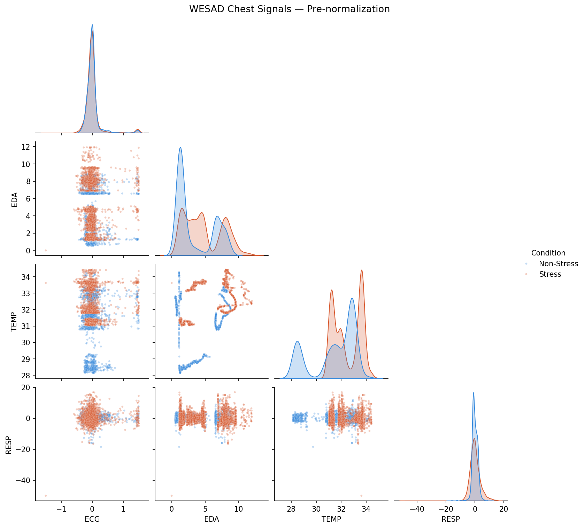
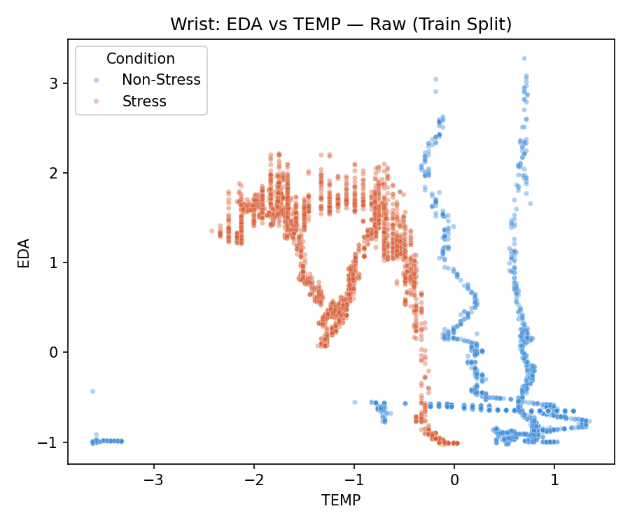
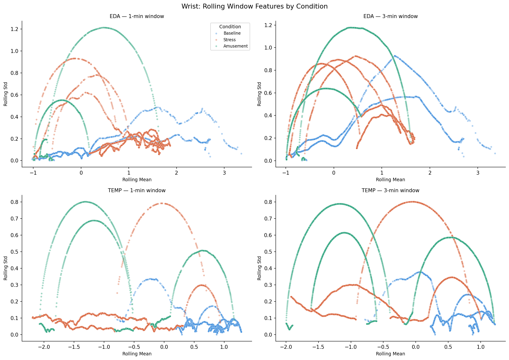
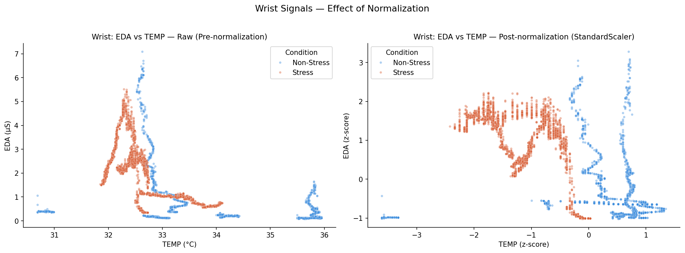

Slides: [slides.html](slides.html){target="_blank"} ( Go to `slides.qmd`
to edit)


## Introduction


Stress detection in real-time, and more importantly biomarkers, have gained interest as both military and corporate facilities aim to improve the quality of worker health and performance. This has let to extensive research using commercial wearables that record signals such as beats per minute (BPM), heartrate (HR), heart rate variability (HRV), galvanic skin conductance (EDA), respiration (RESP), and temperature (TEMP). These physiological signals are used in tandem with both stochastic models such as ARIMA and machine learning such as Random Forest. Both types of models offer their own positives and negatives when predicting physiological data. For example, ARIMA is a more traditional, linear-based model, requires less data for training and extrapolation, while Random Forest is more data-intensive but does not assume linearity, making it better suited for modeling complex patterns. 

In this paper, we hope to explore whether it is possible for the simpler ARIMA model to predict stress state at the same accuracy of a machine learning model like Random Forest. If the ARIMA can perform similar to or greater, this makes an argument that it is still possible to predict stress in physiological signals without the intensive training needed in machine learning, despite ARIMA’s assumptions and limitations. To explore this, we chose the WESAD dataset, which contains multimodal physiological data collected from participants as they underwent different activities, such as no-stress, stress, and amusement. Based on our literature review, we have found that the best physiological signals for predicting stress state that are also provided by the dataset include HR, HRV, and EDA, and that these metrics can be enhanced with secondary metrics such as RESP and TEMP. One paper, [@oyeleye2022] found that the accuracy of ARIMA prediction can be heavily improved using the “rolling window” approach. This helped the model predict based on the signal during different windows of time instead of treating each sample independently of the other. In our methodology we plan to create a pipeline to preprocess the data, compute our feature metrics, derive rolling windows, and predict a given metric using both ARIMA and Random Forest in order to compare the model’s accuracy. 


ARIMA, which stands for Autoregressive Integrated Moving Average, is a classical statistical model widely used for time-series forecasting that captures temporal dependencies within a signal using its own past values and error terms. [@kontopoulou2023] found that ARIMA remains a broadly used and interpretable approach, particularly well-suited for structured, lower-dimensional datasets where its linearity assumptions hold reasonably well. Critically, [@ziyadidegan2025] identified ARIMA as an underutilized but promising method specifically for physiological stress research, appearing in only 3 of 119 reviewed cardiovascular stress studies despite its recognized capacity to capture temporal rhythms in cardiovascular and electrodermal signals. Given that ECG-derived metrics reflect the electrical activity of the heart and EDA captures the skin's electrodermal response to psychological arousal, both of which change measurably during stress, the temporal structure of these signals makes them theoretically well-suited for time-series modeling through ARIMA with a rolling window approach. If stress-related changes in ECG and EDA follow predictable temporal patterns, ARIMA may be capable of detecting stress states without the computational demands of machine learning, a question this study directly investigates. 

It is well established that EDA is an excellent parameter of SNS activation, while recent studies have demonstrated that EDA combined with other complementary signals, such as PPG, skin temperature and respiration, provides more reliable stress classification than any single signal. [@luzzani2024] examined the statistical correlation between the Photoplethysmogram (PPG), the Electrodermal Activity (EDA) and the skin temperature in relation to stress and mental workload, through the analysis of 43 features of the signals, obtained during cognitive tests, using statistical tests such as Kruskal-Wallis and Mann-Whitney U. They determined that about half of these features possessed strong statistical evidence of differentiating relaxed from altered emotional states, while 15 of them had sufficient information to detect both mental workload and stress level. The finding is directly relevant to our project question, which is what physiological signals that are continuously sensed can be meaningfully categorized, as it gives empirical statistical support for selecting the physiological features that best discriminate stress from non-stress states for the rules of threshold and baseline deviation that we are developing. 

This concords with [@sosaetal2026], who explained, in their systematic review, that EDA is a strong indicator of the arousal of the sympathetic nervous system, but that EDA is only one part of the response, and therefore multimodal systems utilizing various physiological signals, such as EDA and HRV, PPG, skin temperature, and blood oxygen should be developed. The review also outlines how heart rate variability provides information on the parasympathetic nervous system and EDA provides information on the sympathetic nervous system and sweat gland activity; using both sensors can provide more comprehensive and detailed information about an individual's autonomic state. This paper reinforces our desire to focus on a multimodal approach to stress that combines EDA, respiration and temperature even though we have included heart rate as an additional measurement since, taken by itself, this only provides a partial picture of stress.

Random Forest is an ensemble machine learning method that builds multiple decision trees and aggregates their outputs to produce robust classifications, making no assumptions about the linearity or distribution of the underlying data. [@garg2021] evaluated Random Forest alongside several other classifiers including k-NN, Linear Discriminant Analysis, AdaBoost, and Support Vector Machine on the WESAD dataset, finding that Random Forest achieved consistently strong performance across both binary stress versus non-stress and three-class neutral, stress, and amusement classification tasks. [@schmidt2018], who originally introduced the WESAD dataset, a multimodal physiological signal collection from 15 subjects recorded across controlled stress, baseline, and amusement conditions using wrist-worn and chest-worn devices capturing signals including ECG and EDA among others, also conducted preliminary Random Forest experiments achieving 88.33% baseline accuracy, further establishing it as the benchmark comparator for this study. Together, these findings position Random Forest as a well-validated and high-performing method for stress classification on WESAD, and the central question of this study is whether the simpler, interpretable ARIMA model can achieve comparable predictive performance on ECG and EDA signals alone.

Variables 

This study utilizes the physiological signal variables that were available in WESAD A dataset and a number of engineered features. 
Each variable was selected based on its established role in autonomic nervous system research and its relevance to distinguishing neutral, stress, and amusement states.

Raw Physiological Signals 

Electrocardiogram (ECG) : The signal from which ECG is measured is the electrical activity of the heart. From which heart rate (HR) and heart rate variability (HRV) are calculated. ECG was added as it is directly controlled by the Sympathetic and parasympathetic nervous systems and stress reliably Causes physical effects in cardiac rhythm 
We use ECG as our initial time-series target for this project because it is a large dataset that is already available. 
The ARIMA model was used, because its temporal structure is regular beat-to-beat, and the historical data was not needed. adaptable to autonomic loading intervals makes it suitable for adapting to changing autonomic loading intervals. autoregressive modeling. 

Electrodermal Activity (EDA) : EDA records the electrical conductivity of the skin, which is higher with The sympathetic nervous system-induced sweat gland activity. 
EDA was Added as it is one of the most consistent and well documented. Physiological indicators of psychological arousal and stress (Ziyadidegan et al. 2024) 
This is confirmed by descriptive numbers, which we derived from our data, for mean EDA, as shown below: 
The proportion of this dataset in the Stress range increased by about 40% compared with the Neutral range. 
EDA is used to predict things both as a raw predictor and with the use of ECG as one of the. The two core signals were modeled using ARIMA.

Respiration (RESP) : RESP is the expansion/contraction of the chest as it relates to breathing. It was considered as a secondary indicator as breathing pattern changes (accelerated and shallower breathing and irregular) commonly accompany stress responses. 
In our descriptive statistics, RESP had higher Under Stress conditions (std = 3.57), the variability was greater compared to Neutral conditions. While this is favorable, its standard deviation (std = 2.08) justifies its use as a corroborating signal, despite the fact that it suffers from this drawback. It was not among the two main ARIMA targets. 

Skin Temperature (TEMP) : TEMP is not the skin temperature of the central area but rather the peripheral skin temperature, which may decrease slightly. When stressed, causes vasoconstriction (blood flow diverted away from the skin). TEMP was included as a secondary/supporting variable in our data it showed the smallest separation across conditions of the four signals, so it was used to enrich the feature set for Random Forest rather than as a primary predictive target.

Derived Variables

Label (target variable) : The categorical outcome variable coded 1 = Neutral (Baseline), 2 = Stress, 3 = Amusement, as defined by the WESAD protocol (Schmidt and Reiss 2018).
 This is the variable both models are ultimately trying to predict, either directly (Random Forest) or after converting a continuous ARIMA forecast into a categorical state (ARIMA classification framework).

Subject : A category identifier (S2, S3, S4, etc.) that is used to group observations by participant. This variable is not used as a predictor itself, but all are essential to prevent cross-subject data leakage: Normalization, lag creation and train/test splitting is done independently within each subject's timeline in such a way that no subject's history contaminates another's. 

Z-score / Standardized signal values : Each raw signal (ECG, EDA, TEMP, RESP) was converted to a z-score using StandardScaler fit only on that subject's training data: $z = \frac{x - \mu}{\sigma}$. 
This was added as a precaution for the following reason: A physiological baseline is highly variable from individual to individual (e.g., one person may have a lower baseline than another). The resting EDA may vary among individuals (or within an individual, depending on the person, may be naturally higher than another's), so individual baseline differences are eliminated and all Prior to the models having access to the data, subjects are ranked on a common scale for each subject. 

Lag features : Lag time is indicated by the variables (EDA_lag_1, EDA_lag_2, EDA_lag_3, EDA_lag_4). Four one-step-back values were added as new columns for each signal, Explicitly giving the model about one second of history (at 4 Hz) 
For each row, there are various options available. 
These were included specifically to compensate for a structural weakness of Random Forest: unlike ARIMA, Random Forest has no built-in concept of time or sequence, so lag features are how we manually inject short-term temporal context into an otherwise order-blind model.

Rolling window features : The rolling window features includes (1-minute and 3-minute rolling mean/std). The rolling mean and rolling standard deviation were used for ECG and EDA. The 1-minute and 3-minute windows were used to compute. 
These were incorporated into the program to capture stress dynamics at two different timescales: the 1-minute window is meant to catch short-term stress onset, while the 3-minute window is meant to capture sustained stress responses (Ziyadidegan et al. 2024; 
Oyeleye et al. 2022). 
Rolling features also give Random Forest a smoothed, denoised version of each signal, which helps offset its sensitivity to momentary sensor noise or motion artifacts.


### Statistics table and variable selection 

Based on our literature review, we selected ECG, EDA, TEMP and RESP as our primary physiological signals for stress detection. ECG captures heart rate and heart rate variability which consistently change during stress, as supported by Ziyadidegan et al. (2025) and Oyeleye et al. (2022). EDA directly reflects sympathetic nervous system activity, the system activated during stress, while skin temperature complements it by capturing additional autonomic responses, both supported by Sosa et al. (2024). Respiration was included based on Sosa et al. (2024) recommendation that combining EDA, RESP and TEMP provides a more complete picture of autonomic stress response than any single signal alone.

| Condition | ECG Mean | ECG Std | EDA Mean | EDA Std | TEMP Mean | TEMP Std | RESP Mean | RESP Std |
|-----------|----------|---------|----------|---------|-----------|----------|-----------|----------|
| Neutral   | 0.001    | 0.227   | 3.426    | 2.622   | 31.039    | 1.787    | 0.051     | 2.078    |
| Stress    | 0.001    | 0.252   | 4.790    | 2.834   | 32.476    | 1.083    | 0.049     | 3.574    |
| Amusement | 0.001    | 0.215   | 3.400    | 3.288   | 32.764    | 0.460    | 0.054     | 2.164    |

*Table 1: Descriptive statistics (mean and standard deviation) for ECG, 
EDA, TEMP, and RESP signals across Neutral, Stress, and Amusement 
conditions from the WESAD chest sensor dataset (N = 15 subjects) 
[@schmidt2018].*

Before normalization, raw signal distributions were examined across 
all three conditions to identify class separation patterns.

{width=100%}

{width=70%}

{width=90%}


{width=100%}


## Analysis and Results

### Data Exploration and Visualization

The WESAD dataset was preprocessed using chest and wrist sensor signals from three subjects (S2, S3, S4). Chest signals included ECG, EDA, TEMP, and RESP sampled at 700Hz, while wrist signals included EDA and TEMP sampled at 4Hz. Only valid stress-related labels were retained: Baseline (label 1), Stress (label 2), and Amusement (label 3).

Based on our literature review, we selected ECG, EDA, TEMP and RESP as our primary physiological signals for stress detection. ECG captures heart rate and heart rate variability which consistently change during stress, as supported by Ziyadidegan et al. (2025) and Oyeleye et al. (2022). EDA directly reflects sympathetic nervous system activity, the system activated during stress, while skin temperature complements it by capturing additional autonomic responses, both supported by Sosa et al. (2024). Respiration was included based on Sosa et al. (2024) recommendation that combining EDA, RESP and TEMP provides a more complete picture of autonomic stress response than any single signal alone.

### Modeling and Results

We applied Random Forest classification in two stages to evaluate stress state detection performance across chest and wrist sensors.

**Stage 1: Baseline Random Forest (Row-by-Row Classification)**

As an initial baseline, we applied Random Forest directly to individual data points without any temporal feature engineering. This represents the simplest possible classification approach and serves as a reference point for evaluating the benefit of windowed features.

| Class | Precision | Recall | F1-Score | Support |
|-------|-----------|--------|----------|---------|
| Neutral | 1.00 | 0.67 | 0.80 | 2,743 |
| Stress | 0.62 | 1.00 | 0.77 | 1,512 |
| Amusement | 1.00 | 1.00 | 1.00 | 888 |
| Overall Accuracy | | | 0.82 | 5,143 |
| Macro Average | 0.87 | 0.89 | 0.86 | 5,143 |

The baseline model achieved an overall accuracy of 82% and a macro F1-score of 0.86. While the model performed well on Neutral and Amusement classes, Stress recall was perfect at 1.00 but precision was lower at 0.62, indicating some false positive stress detections.

**Stage 2: Rolling Window Random Forest (1-min and 3-min Windows)**

To better capture temporal physiological patterns associated with stress, we applied lag features and rolling window statistics at 1-minute and 3-minute intervals. This approach is more realistic for real-world stress detection since physiological responses to stress develop over time rather than instantaneously.

*Chest Sensor Results (ECG, EDA, TEMP, RESP at 700Hz):*

| Subject | Precision | Recall | F1-Score |
|---------|-----------|--------|----------|
| S2 | 0.7639 | 0.8446 | 0.7471 |
| S3 | 0.9516 | 0.8991 | 0.9145 |
| S4 | 0.7479 | 0.6678 | 0.4663 |

*Wrist Sensor Results (EDA, TEMP at 4Hz):*

| Subject | Precision | Recall | F1-Score |
|---------|-----------|--------|----------|
| S2 | 1.0000 | 1.0000 | 1.0000 |
| S3 | 0.4535 | 0.6667 | 0.5100 |
| S4 | 1.0000 | 1.0000 | 1.0000 |

### Conclusion for Random Forest

The baseline Random Forest model achieved reasonable performance at 82% accuracy, demonstrating that physiological signals from the WESAD dataset contain sufficient information for stress state detection. The rolling window approach showed varied performance across subjects, with S3 showing lower F1-scores in both chest and wrist models, suggesting higher physiological variability in that participant. Chest sensor signals generally provided more consistent results across subjects compared to wrist signals, which is consistent with findings in the literature that chest-worn sensors capture higher quality physiological data. These Random Forest results serve as the baseline for comparison against the ARIMA model results.

## Methods

### Participant Selection
Before training our models, we must first pre-process the physiological data for participants S2, S3, and S4. These three are participants with complete datasets and show as a proof of concept for predicting stress state using both the ARIMA and RF models. In this project we will compare classification metrics per participant and overall participants using their z-scored values. [paper 9] 

### Preprocessing and Normalization
Raw physical signals for ECG, EDA, RESP, and TEMP were extracted for the participants. The signals were trimmed to the minimum common length across signals for proper alignment. Physiologically implausible values were treated as artifacts such as temperature ranging outside 25-45 degrees Celsius and negative EDA values. These artifacts were imputed using forward-and-backward filling to preserve temporal continuity. [paper] Only stress, baseline, and amusement states [labels 1-3] were retained for chest signals, and to synchronize with wrist signals, were down sampled from 700Hz to 4Hz using majority-vote labeling within each 175-sample interval.

With our physio data pre-processed, it could then be normalized to meet the assumptions of our models. [@oyeleye2022, @kontopoulou2023] The chest and wrist datasets were split into training (80%) and testing (20%) sets using a block-stratified chronological split. For each participant, the first 80% of each condition block was assigned for training, with the remaining 20% held out for testing. This method preserved temporal order and ensured all conditions (stress, baseline, and amusement) were represented in both sets.
Feature normalization was performed for each subject separately using StandardScaler. Scaling parameters (mean and standard deviation) was estimated using only the training set and then applied to both the training and the test set. This transformed each physiological feature into a standardized z-score and prevented information leakage from the test set. 
The z-score transformation can be represented as 
$$ z = \frac{x - \mu}{\sigma} $$
Where x is the original observation, $/mu$ is the mean of the training data, and $/sigma$ is the standard deviation. This centers each feature around zero and scales it to unit variance, allowing ECG, EDA, RESP, and TEMP features to be compared on a common scale. 

#### Rolling Window Features

To capture the temporal dynamics of physiological stress responses, rolling window features were engineered from the normalized ECG and EDA signals. For each signal at time $t$, a window of size $w$ was applied to compute the rolling mean:

$$\mu_{t,w} = \frac{1}{w}\sum_{i=t-w+1}^{t} x_i$$

and rolling standard deviation:

$$\sigma_{t,w} = \sqrt{\frac{1}{w}\sum_{i=t-w+1}^{t}(x_i - \mu_{t,w})^2}$$

Two window sizes were applied which are 1-minute and 3-minute windows in order to capture both short-term stress onset patterns and longer-term sustained stress responses [@ziyadidegan2025]. These rolling features give the Random Forest model an explicit temporal context window, partially 
compensating for its lack of built-in sequential awareness [@kontopoulou2023].

## Assumptions of ARIMA

ARIMA, or Autoregressive Integrated Moving Average, predicts a future observation using a combination of past observations and forecasting errors.

$$
\text{ARIMA}(p,d,q)
$$

where:

- $p$ = number of autoregressive (AR) terms, which use previous observations to predict the current value.
- $d$ = number of differencing operations applied to make the time series stationary.
- $q$ = number of moving average (MA) terms, which use previous forecast errors to improve future predictions.

### The Core Assumptions:
 - Assumption of Stationarity: ARIMA assumes that the series is stationary, meaning that the statistical properties of the time series are relatively constant over time. In physiological data, trends/shift may occur during changes in activity. 
 - Assumptions of Linear Temporal Dependence: ARIMA assumes the future predicted values can be explained by a linear combination of previous observations (autoregression) and previous forecasting errors (moving average). It cannot model complex nonlinear relationships between physio signals directly, because of this the autoregressive parameter 'p' is usually much higher when predicting physio data, weighing heavily previous observations.
 
An ARIMA$(p,d,q)$ model is defined as

$$
\phi(B)(1-B)^d y_t = c + \theta(B)\varepsilon_t
$$

where:

- $y_t$ is the observed physiological signal at time $t$,
- $B$ is the backshift operator ($By_t = y_{t-1}$),
- $d$ is the order of differencing required to achieve stationarity,
- $\phi(B)$ is the autoregressive polynomial of order $p$,
- $\theta(B)$ is the moving average polynomial of order $q$,
- $c$ is a constant term,
- $\varepsilon_t$ represents random white-noise errors.
 
### ARIMA Classification Framework
 - Transformation A Continuous Forecast Generation: 
  The Action: When later categorizing a continuous variable, it is necessary for the continuous variable to remain continuous for as long as possible.  ARIMA produced continuous forecasts for each physiological signal. 
  The Result: Taking the rolling windows, the model was able to make predictions in a way that helped preserve the physiological trend as outlined in [@oyeleye2022]
 - Transformation B Participant-Specific State Classification:
  The Action: To then categorize the ARIMA prediction, the forecast was compared against participant-specific ranges derived from the training data (rolling windows) during the activities to assign Baseline, Stress, or Amusement labels. [@aigrain2015, @beltran2024]
  The Reason: With the ARIMA output categorized, it can then by evaluated using the same classification metrics as Random Forest in order to answer our hypothesis.


### Random Forest Classification Framework

The predictive model used for multi-class affective state classification is the non-parametric Random Forest algorithm. Formally, a Random Forest is an ensemble classifier consisting of a collection of structured decision trees $\{h(x, \theta_k), k = 1, \dots\}$ where the parameters $\{\theta_k\}$ are independent, identically distributed random vectors, and each individual tree casts a single unit vote for the most popular class at input feature vector $x$.

The foundational non-parametric regression and classification framework can be defined by the following sequence:

$$Y_i = m(X_i) + \varepsilon_i$$

where $Y_i$ represents the target affective stress label ($Y_i \in \{1, 2, 3\}$: Neutral, Stress, Amusement), which is defined as the sum of the true underlying physiological mapping function value $m(x)$ for the feature tensor $X_i$, and $\varepsilon_i$ represents the random observation errors.

In this implementation, the target function $m(x)$ is mathematically unknown. With the help of this definition, we create a robust local averaging estimation by aggregating a multitude of decorrelated randomized decision trees ($T$). The ultimate classification function estimation formula is printed below:

$$\hat{m}(x) = \text{mode} \left\{ T_1(x), T_2(x), \dots, T_B(x) \right\}$$

In other words, this means that we are discovering the emotional state boundaries across the physiological multi-sensor space with the help of bootstrap aggregation (bagging) and randomized feature sub-selection across $B$ independent trees ($B = 100$). This collective voting structure decreases the overall structural variance of individual decision trees without increasing the model's bias.

#### Justification of Choices Based on Problem and Data
We chose the Random Forest algorithm for this comparative time-series framework based on specific properties of the WESAD wearable dataset:

- **Handling of Non-Linear Physiological Interaction:** Autonomic nervous system responses do not follow strict linear bounds; a spike in skin conductance (EDA) combined with a drop in skin temperature (TEMP) creates highly complex, non-linear patterns during stress episodes.
- **Robustness to Sensor Artifacts and Noise:** Wearable sensor data collected in the field is prone to sudden movement artifacts. Because Random Forest splits nodes by evaluating localized subsets of data and features via the Gini impurity index, it prevents individual extreme outliers or sensor errors from corrupting the global classification boundaries.

### Assumptions of Random Forest

#### The Core Assumptions:
  - Assumption of Sample Independence (The Time-Series Violation): Random Forest assumes 
    that each row of data is an independent observation. In time-series physiological data, 
    this assumption is completely violated due to temporal autocorrelation (your heart rate 
    or skin conductance at second t is highly dependent on second t-1).
  - Assumption of Non-Stationary Invariance: Random Forest cannot extrapolate trends outside 
    the maximum and minimum values it saw during training. If a subject's raw skin conductance 
    drifts over the course of an afternoon, the model's tree splits will completely lose 
    accuracy on future data.
  - Assumption of Identity Mapping: Standard Random Forest has no built-in mechanism to 
    recognize sequential order or velocity. It treats a static signal value the same way 
    whether that signal is spiking upward or crashing downward.

#### How the variables are transformed (Our Solution):
  To satisfy these assumptions and make the WESAD variables ready for prediction, we 
  implemented three mandatory engineering transformations [@garg2021]:
 
  - Transformation A: Subject-Specific Standardization (Locally Scaled)
    The Action: We transformed the raw variables (ECG, EDA, TEMP) using StandardScaler 
    fitted strictly per subject within their independent training partitions.
    The Reason: This removes individual baseline human biological variances (e.g., one person 
    naturally sweating more than another) and centers all features around a mean of 0 and a 
    standard deviation of 1. This scales the data safely into a uniform range across all 
    subjects without causing data leakage.
 
  - Transformation B: Temporal Lag Feature Engineering (Creating Memory)
    The Action: We engineered four steps of historic back-shifting for each sensor variable 
    (creating new columns: EDA_lag_1, EDA_lag_2, etc.).
    The Reason: This converts the sequential time dependency into static, structural columns 
    within a single row. It gives the Random Forest an explicit "context window" of the past 
    1 second of history (at 4Hz), allowing the decision trees to calculate the speed and 
    direction of the physiological shift.
 
  - Transformation C: Chronological Condition-Block Stratification
    The Action: We transformed how the training and testing matrices were sliced by performing 
    an 80/20 sequential split inside each isolated experimental condition block (Neutral, Stress, 
    Amusement) [@schmidt2018].
    The Reason: This preserves the real-world sequence of the timeline while forcing both the 
    training and testing datasets to hold a representative distribution of all three target 
    states, solving the classification target-mismatch issue [@kontopoulou2023].

$$ M_n(x) = \sum_{i=1}^{n} W_n (X_i) Y_i \tag{1} $$

*$W_n(x)$ is the sum of weights that belongs to all real numbers. Weights are positive numbers and small if $X_i$ is far from $x$.*

#### Justification of Choices Based on Problem and Data
This non-parametric local averaging framework (Equation 1) is explicitly chosen for our WESAD wearable sensor prediction task instead of standard parametric regression algorithms, which typically assume a strict linear profile [@schmidt2018]:

$$ y_i = \beta_0 + \beta_1 X_1 +\varepsilon_i \tag{2} $$

A parametric linear model (Equation 2) assumes a constant, straight-line relationship that completely fails when applied to the complex, non-linear biological response profiles found within multi-modal wearable sensor streams [@ziyadidegan2025]. We chose the Random Forest framework based on three specific data properties that align with this non-parametric local estimation approach:

- **Handling of Non-Linear Physiological Interaction:** Autonomic nervous system responses do not follow strict linear bounds; a spike in skin conductance (EDA) combined with a drop in skin temperature (TEMP) creates highly complex, non-linear patterns during stress episodes [@ziyadidegan2025]. Random Forest handles these multi-modal, non-linear relationships out of the box through step-wise feature space partitioning without requiring restrictive linear coefficients like those in Equation 2.
- **Robustness to Sensor Artifacts and Noise:** Wearable sensor data collected in the field is prone to sudden movement artifacts and temporary data dropouts [@garg2021]. Because Random Forest splits nodes by evaluating localized subsets of data and features via the Gini impurity index, it acts as a robust local estimator, preventing individual extreme outliers or sensor errors from corrupting the global classification boundaries.
- **Resistance to Temporal Overfitting:** High-frequency biological streams exhibit intense temporal autocorrelation, which can cause standard models to overfit on specific timeline segments. By utilizing independent bootstrap samples for each tree and forcing a structural 80/20 chronological split inside isolated condition blocks, the Random Forest maintains strict out-of-sample operational testing validity [@kontopoulou2023].


#### Feature Importance

Random Forest provides a built-in feature importance measure based on the mean decrease in impurity across all trees for each feature. This was used to identify which physiological signals and rolling window features most strongly predicted stress state classification across subjects S2, S3, and S4 from the WESAD dataset [@garg2021].

## Data Ingestion and Automated Feature Alignment

The initial phase of the predictive pipeline establishes a robust data ingestion layer designed to load partitioned datasets, dynamically detect available sensor modalities, and enforce structural timeline isolation.
 Ingestion Protocols and Format Mapping - The processing script programmatically interfaces with two pre-arranged disk files: wesad_wrist_train.csv (the training matrix) and wesad_wrist_test.csv (the holdout evaluation matrix). The ingestion sequence is mapped via the pandas framework using explicit memory allocation constraints:Tabular Parsing: The continuous comma-separated streams are read into isolated memory frames (train_df and test_df) as multi-column tabular arrays.DataFrame Casting: Arrays are strictly enforced as traditional mutable matrices (as.data.frame structural equivalents) to allow downstream indexing and chronological row transformations.Random State Initialization: To stabilize any internal stochastic data handling or bootstrapping mechanisms during the initial load phase, a global seed is instantiated using random_state=42. Dynamic Channel Scanning and Feature Verification - Because wearable sensor platforms can experience hardware dropouts, or variations between chest-worn and wrist-worn sensor matrices, the ingestion layer implements a dynamic channel scanner.

The system verifies a default physiological target array consisting of Electrodermal Activity (EDA), Body Temperature (TEMP), and Electrocardiogram (ECG) metrics. Rather than assuming strict structural permanence, the ingestion function runs an inline list comprehension.
The ingestion layer dynamically scans for available sensor channels rather than assuming fixed column structure. Only signals present in 
the loaded CSV are passed downstream — if a sensor modality is missing, the pipeline skips it gracefully without crashing. This makes the 
pipeline robust to differences between chest and wrist sensor files.


Chronological Grouping and Boundary Defense - To maintain strict data integrity during ingestion and prevent cross-subject timeline pollution, the loading sequence prevents global, un-grouped data operations.Data matrices are partitioned into isolated historical blocks using a split-apply-combine approach on the categorical subject identifier. This ensures that the chronological continuity of each participant's biometric timeline is preserved:

By isolating the timelines within individual subject blocks and explicitly invoking a index-sorting mechanism (.sort_index()), the ingestion layer provides a clear guarantee: no row from Subject A can accidentally inherit historical lag metrics from Subject B.Any boundary artifacts created by tracking changes at the very beginning of a subject's timeline are handled by a .dropna() filter, leaving a clean, continuous, and fully isolated data structure for model training.

### Pre processing

```python
import pickle
import numpy as np
import pandas as pd
import os

subjects = [
    'S2','S3','S4','S5','S6','S7','S8','S9',
    'S10','S11','S13','S14','S15','S16','S17'
]
VALID_LABELS = [1, 2, 3]
chest_dfs = []
wrist_dfs = []


# ----------------------------------------------------
# MAIN LOOP
# ----------------------------------------------------
for subject in subjects:
    path = f'/home/iu6/IDC6940_RandomForest/Dataset_WESAD/{subject}/{subject}.pkl'
    if not os.path.exists(path):
        print(f"[SKIP] {subject} not found")
        continue
        
    print(f"\nProcessing {subject}...")
    with open(path, 'rb') as f:
        data = pickle.load(f, encoding='latin1')
        
    # Get the raw, unbroken 700Hz timeline bounds
    raw_labels = np.array(data['label']).flatten()
    raw_ecg = np.array(data['signal']['chest']['ECG']).flatten()
    raw_eda = np.array(data['signal']['chest']['EDA']).flatten()
    raw_temp = np.array(data['signal']['chest']['Temp']).flatten()
    raw_resp = np.array(data['signal']['chest']['Resp']).flatten()
    
    # Track minimum length to trim trailing-end sensor shutoff mismatches safely
    min_len = min(len(raw_labels), len(raw_ecg), len(raw_eda), len(raw_temp), len(raw_resp))

    # -------------------------
    # CHEST SIGNALS (100% continuous for NeuroKit2 windowing)
    # -------------------------
    chest_df = pd.DataFrame({
        'subject': subject,
        'ECG': raw_ecg[:min_len],
        'EDA': raw_eda[:min_len],
        'TEMP': raw_temp[:min_len],
        'RESP': raw_resp[:min_len],
        'label': raw_labels[:min_len]  # Keeps ALL labels (0,1,2,3,4...) so data stays unbroken
    })
    
    # Handle artifacts without changing the shape or deleting rows
    chest_df.loc[(chest_df['TEMP'] <= 20) | (chest_df['TEMP'] >= 45), 'TEMP'] = np.nan
    chest_df.loc[chest_df['EDA'] < 0, 'EDA'] = np.nan
    chest_df = chest_df.ffill().bfill()  # Cleans sensor errors seamlessly
    chest_df = chest_df[chest_df['label'].isin(VALID_LABELS)]

    
    chest_dfs.append(chest_df)
    print(f"[CHEST CONTINUOUS] {subject}: {chest_df.shape}")

    # -------------------------
    # WRIST SIGNALS (Downsampled labels to match native 4Hz sensors)
    # -------------------------
    wrist_eda = np.array(data['signal']['wrist']['EDA']).flatten()
    wrist_temp = np.array(data['signal']['wrist']['TEMP']).flatten()
    
    
    wrist_len = min(len(wrist_eda), len(wrist_temp))
    # Pick every 175th label to match the slow 4Hz wrist sensors perfectly by time
    wrist_labels = np.array([np.bincount(raw_labels[i:i+175]).argmax() for i in range(0, len(raw_labels), 175)])[:wrist_len]
    
    wrist_df = pd.DataFrame({
        'subject': subject,
        'EDA': wrist_eda[:wrist_len],
        'TEMP': wrist_temp[:wrist_len],
        'label': wrist_labels
    })
    
    # Wrist can be filtered row-by-row because her NeuroKit pipeline isn't analyzing the wrist
    wrist_df = wrist_df[wrist_df['label'].isin(VALID_LABELS)]
    wrist_df = wrist_df.dropna()
    wrist_dfs.append(wrist_df)
    print(f"[WRIST CLEAN] {subject}: {wrist_df.shape}")

# ----------------------------------------------------
# FINAL DATASET EXPORT
# ----------------------------------------------------
print("\nCombining datasets...")
chest_final = pd.concat(chest_dfs, ignore_index=True)
wrist_final = pd.concat(wrist_dfs, ignore_index=True)

print("\nFinal Chest shape (Continuous):", chest_final.shape)
print("Final Wrist shape (Clean Tabular):", wrist_final.shape)

chest_final.to_csv("wesad_chest_clean.csv", index=False)
wrist_final.to_csv("wesad_wrist_clean.csv", index=False)
print("\nSaved cleaned datasets successfully. Ready for handoff!")


```
#| code-fold: true


```python
import pandas as pd
from sklearn.ensemble import RandomForestClassifier
from sklearn.metrics import classification_report, f1_score, precision_score, recall_score

```
#| code-fold: true

```python
# Load Data
print("=== Starting Random Forest Model Loop ===")

# 1. READ PRE-SPLIT, PRE-NORMALIZED FILES
print("Loading data splits...")
train_df = pd.read_csv("wesad_wrist_train.csv")
test_df = pd.read_csv("wesad_wrist_test.csv")

# 2. FEATURE ENGINEERING: COMPUTE TEMPORAL LAG ARRAYS WITH ECG INCLUDED
# Updated default list to scan for ECG, EDA, and TEMP features dynamically
def apply_time_lags(df, features=['ECG', 'EDA', 'TEMP']):
    # Filter features list to match only columns that exist inside the CSV file
    valid_features = [f for f in features if f in df.columns]
    print(f" -> Engineering lag features for existing channels: {valid_features}")
    
    lagged_groups = []
    # Loop ensures lags are calculated within each subject timeline independently
    for subject, group in df.groupby('subject'):
        group_copy = group.sort_index().copy()
        for col in valid_features:
            for lag in range(1, 5): # 4 lags = 1 second of context at 4Hz
                group_copy[f'{col}_lag_{lag}'] = group_copy[col].shift(lag)
        lagged_groups.append(group_copy.dropna())
    return pd.concat(lagged_groups, ignore_index=True)

print("Engineering lag context windows...")
train_lagged = apply_time_lags(train_df)
test_lagged = apply_time_lags(test_df)

# Filter feature columns out from metadata columns
feature_columns = [c for c in train_lagged.columns if c not in ['subject', 'label']]

# ====================================================
# 3. INDEPENDENT SUBJECT TRAINING LOOP
# ====================================================
for subject, group in train_lagged.groupby('subject'):
    print(f"\nTraining Random Forest Classifier for {subject}...")
    
    # Isolate training inputs for this subject
    X_train = group[feature_columns]
    y_train = group['label']
    
    # Isolate testing inputs from the matching hidden test split file
    test_group = test_lagged[test_lagged['subject'] == subject]
    X_test = test_group[feature_columns]
    y_test = test_group['label']
    
    # Initialize Random Forest with balanced class weights to address label skew
    rf_model = RandomForestClassifier(n_estimators=100, class_weight='balanced', random_state=42)
    rf_model.fit(X_train, y_train)
    
    # Evaluate performance
    y_pred = rf_model.predict(X_test)
    
    macro_f1 = f1_score(y_test, y_pred, average='macro')
    macro_prec = precision_score(y_test, y_pred, average='macro', zero_division=0)
    macro_rec = recall_score(y_test, y_pred, average='macro', zero_division=0)
    
    print(f"[{subject} Metrics Summary]")
    print(f" -> Macro Precision : {macro_prec:.4f}")
    print(f" -> Macro Recall    : {macro_rec:.4f}")
    print(f" -> Macro F1-Score  : {macro_f1:.4f}")
    print("\nDetailed Per-Class Performance:")
    print(classification_report(y_test, y_pred, labels=[1, 2, 3], target_names=['Neutral', 'Stress', 'Amusement'], zero_division=0))

print("\n=== Random Forest Execution Loop Complete ===")
 

```
### Data and Visualization
```python
#| code-fold: true
#| eval: false
#| label: scatter-visualization
import pandas as pd
import numpy as np
import seaborn as sns
import matplotlib.pyplot as plt

label_map = {1: 'Baseline', 2: 'Stress', 3: 'Amusement'}
palette   = {'Baseline': '#378ADD', 'Stress': '#D85A30', 'Amusement': '#1D9E75'}
FS = 4

# -------------------------------------------------------
# HELPER: same engineer_features as RF pipeline
# -------------------------------------------------------
def engineer_features(df, fs=4):
    valid_features = [f for f in ['EDA', 'TEMP'] if f in df.columns]
    win_1min = fs * 60
    win_3min = fs * 60 * 3
    groups = []
    for subject, group in df.groupby('subject'):
        g = group.sort_index().copy()
        for col in valid_features:
            for lag in range(1, 5):
                g[f'{col}_lag_{lag}'] = g[col].shift(lag)
            g[f'{col}_roll1min_mean'] = g[col].rolling(window=win_1min, min_periods=1).mean()
            g[f'{col}_roll1min_std']  = g[col].rolling(window=win_1min, min_periods=2).std()
            g[f'{col}_roll3min_mean'] = g[col].rolling(window=win_3min, min_periods=1).mean()
            g[f'{col}_roll3min_std']  = g[col].rolling(window=win_3min, min_periods=2).std()
        groups.append(g.dropna())
    return pd.concat(groups, ignore_index=True)

# -------------------------------------------------------
# 1. CHEST PAIRPLOT — raw signals, pre-normalization
# -------------------------------------------------------
chest = pd.read_csv("wesad_chest_clean.csv")

sample_c = pd.concat([
    grp.sample(min(3000, len(grp)), random_state=42)
    for _, grp in chest.groupby('label')
]).reset_index(drop=True)
sample_c['Condition'] = sample_c['label'].map(label_map)

g = sns.pairplot(
    sample_c[['ECG', 'EDA', 'TEMP', 'RESP', 'Condition']],
    hue='Condition',
    palette=palette,
    plot_kws={'alpha': 0.3, 's': 8},
    diag_kind='kde',
    corner=True
)
g.figure.suptitle('WESAD Chest Signals — Pre-normalization', y=1.01, fontsize=13)
plt.savefig("wesad_chest_pairplot.png", dpi=150, bbox_inches='tight')
plt.show()
print("Saved: wesad_chest_pairplot.png")

# -------------------------------------------------------
# 2. WRIST — raw EDA vs TEMP (from train split)
# -------------------------------------------------------
train_df = pd.read_csv("wesad_wrist_train.csv")

sample_w = pd.concat([
    grp.sample(min(3000, len(grp)), random_state=42)
    for _, grp in train_df.groupby('label')
]).reset_index(drop=True)
sample_w['Condition'] = sample_w['label'].map(label_map)

fig, ax = plt.subplots(figsize=(6, 5))
sns.scatterplot(data=sample_w, x='TEMP', y='EDA',
                hue='Condition', palette=palette,
                alpha=0.4, s=12, ax=ax)
ax.set_title('Wrist: EDA vs TEMP — Raw (Train Split)')
plt.tight_layout()
plt.savefig("wesad_wrist_raw_scatter.png", dpi=150)
plt.show()
print("Saved: wesad_wrist_raw_scatter.png")

# -------------------------------------------------------
# 3. WRIST — rolling window features (1-min and 3-min)
# -------------------------------------------------------
train_engineered = engineer_features(train_df)
train_engineered['Condition'] = train_engineered['label'].map(label_map)

sample_e = pd.concat([
    grp.sample(min(3000, len(grp)), random_state=42)
    for _, grp in train_engineered.groupby('label')
]).reset_index(drop=True)

fig, axes = plt.subplots(2, 2, figsize=(14, 10))
fig.suptitle('Wrist: Rolling Window Features by Condition', fontsize=13)

plot_pairs = [
    ('EDA_roll1min_mean', 'EDA_roll1min_std',  'EDA — 1-min window'),
    ('EDA_roll3min_mean', 'EDA_roll3min_std',  'EDA — 3-min window'),
    ('TEMP_roll1min_mean','TEMP_roll1min_std', 'TEMP — 1-min window'),
    ('TEMP_roll3min_mean','TEMP_roll3min_std', 'TEMP — 3-min window'),
]

for ax, (xcol, ycol, title) in zip(axes.flatten(), plot_pairs):
    sns.scatterplot(
        data=sample_e, x=xcol, y=ycol,
        hue='Condition', palette=palette,
        alpha=0.4, s=12, ax=ax, legend=(ax == axes[0][0])
    )
    ax.set_title(title, fontsize=10)
    ax.set_xlabel('Rolling Mean', fontsize=9)
    ax.set_ylabel('Rolling Std', fontsize=9)
    ax.spines[['top', 'right']].set_visible(False)

axes[0][0].legend(title='Condition', fontsize=8, title_fontsize=9)
plt.tight_layout()
plt.savefig("wesad_wrist_rolling_scatter.png", dpi=150, bbox_inches='tight')
plt.show()
print("Saved: wesad_wrist_rolling_scatter.png")

```
# Analysis

## Classification metrics:

The following metrics are standard for evaluating the performance of classification models. 

$$
\begin{array}{c|cc}
 & \textbf{Predicted Positive} & \textbf{Predicted Negative} \\
\hline
\textbf{Actual Positive} & TP & FN \\
\textbf{Actual Negative} & FP & TN \\
\end{array}
$$

 - Accuracy: the proportion of correctly classified observations
$$
\text{Accuracy} = \frac{TP + TN}{TP + TN + FP + FN}
$$

 - Precision: measures the proportion of predicted positive observations that are actually positive
$$
\text{Precision} = \frac{TP}{TP + FP}
$$

 - Recall (Sensitivity): the proportion of actual positive observations that are correctly identified
$$
\text{Recall} = \frac{TP}{TP + FN}
$$

- F1: the harmonic mean of precision and recall. 
$$
F1 = 2 \times
\frac{\text{Precision} \times \text{Recall}}
{\text{Precision} + \text{Recall}}
$$
or
$$
F1 = \frac{2TP}{2TP + FP + FN}
$$

## Operational findings:
  While Random Forest demonstrates near-perfect classification capabilities on baseline individuals (S2 and S4 achieving an F1-macro of 1.00), it remains highly susceptible to physiological transition overlap. For Subject S3, the model completely failed to distinguish between the late baseline neutral state and the early stress onset state, defaulting to global stress classification (Stress recall = 1.00, Neutral recall = 0.00[@schmidt2018]. This proves that tabular classifiers struggle when human physiological indicators shift gradually rather than abruptly.


### Modeling and Results

-   Explain your data preprocessing and cleaning steps.

-   Present your key findings in a clear and concise manner.

-   Use visuals to support your claims.

-   **Tell a story about what the data reveals.**

```{r}

```

### Conclusion

-   Summarize your key findings.

-   Discuss the implications of your results.