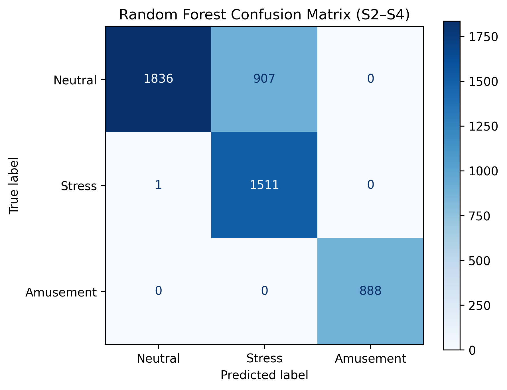

Slides: [slides.html](slides.html){target="_blank"} ( Go to `slides.qmd`
to edit)


## Introduction

Stress detection in real-time, and more importantly biomarkers, have gained interest as both military and corporate facilities aim to improve the quality of worker health and performance. This has let to extensive research using commercial wearables that record signals such as Beats Per Minute (BPM), Heart Rate (HR), Heart Rate Variability (HRV), Electrodermal Activity (EDA), Respiration (RESP), and Temperature (TEMP). These physiological signals are used in tandem with both stochastic models such as ARIMA and machine learning such as Random Forest. Both types of models offer their own positives and negatives when predicting physiological data. For example, ARIMA is a more traditional, linear-based model, requires less data for training and extrapolation, while Random Forest is more data-intensive but does not assume linearity, making it better suited for modeling complex patterns. 

In this paper, we hope to explore whether it is possible for the simpler ARIMA model to predict stress state at the same accuracy of a machine learning model like Random Forest. If the ARIMA can perform similar to or greater, this makes an argument that it is still possible to predict stress in physiological signals without the intensive training needed in machine learning, despite ARIMA’s assumptions and limitations. To explore this, we chose the WESAD dataset, which contains multimodal physiological data collected from participants as they underwent different activities, such as no-stress, stress, and amusement. Based on our literature review, we have found that the best physiological signals for predicting stress state that are also provided by the dataset include HR, HRV, and EDA, and that these metrics can be enhanced with secondary metrics such as RESP and TEMP. One paper, [@oyeleye2022] found that the accuracy of ARIMA prediction can be heavily improved using the “rolling window” approach. This helped the model predict based on the signal during different windows of time instead of treating each sample independently of the other. In our methodology we plan to create a pipeline to preprocess the data, compute our feature metrics, derive rolling windows, and predict a given metric using both ARIMA and Random Forest in order to compare the model’s accuracy. 

ARIMA, which stands for Autoregressive Integrated Moving Average, is a classical statistical model widely used for time-series forecasting that captures temporal dependencies within a signal using its own past values and error terms. [@kontopoulou2023] found that ARIMA remains a broadly used and interpretable approach, particularly well-suited for structured, lower-dimensional datasets where its linearity assumptions hold reasonably well. Critically, [@ziyadidegan2025] identified ARIMA as an underutilized but promising method specifically for physiological stress research, appearing in only 3 of 119 reviewed cardiovascular stress studies despite its recognized capacity to capture temporal rhythms in cardiovascular and electrodermal signals. Given that ECG-derived metrics reflect the electrical activity of the heart and EDA captures the skin's electrodermal response to psychological arousal, both of which change measurably during stress, the temporal structure of these signals makes them theoretically well-suited for time-series modeling through ARIMA with a rolling window approach. If stress-related changes in ECG and EDA follow predictable temporal patterns, ARIMA may be capable of detecting stress states without the computational demands of machine learning, a question this study directly investigates. 

It is well established that EDA is an excellent parameter of SNS activation, while recent studies have demonstrated that EDA combined with other complementary signals, such as PPG, skin temperature and respiration, provides more reliable stress classification than any single signal. [@luzzani2024] examined the statistical correlation between the Photoplethysmogram (PPG), the Electrodermal Activity (EDA) and the skin temperature in relation to stress and mental workload, through the analysis of 43 features of the signals, obtained during cognitive tests, using statistical tests such as Kruskal-Wallis and Mann-Whitney U. They determined that about half of these features possessed strong statistical evidence of differentiating relaxed from altered emotional states, while 15 of them had sufficient information to detect both mental workload and stress level. The finding is directly relevant to our project question, which is what physiological signals that are continuously sensed can be meaningfully categorized, as it gives empirical statistical support for selecting the physiological features that best discriminate stress from non-stress states for the rules of threshold and baseline deviation that we are developing. 

This concords with [@sosa2026], who explained, in their systematic review, that EDA is a strong indicator of the arousal of the sympathetic nervous system, but that EDA is only one part of the response, and therefore multimodal systems utilizing various physiological signals, such as EDA and HRV, PPG, skin temperature, and blood oxygen should be developed. The review also outlines how heart rate variability provides information on the parasympathetic nervous system and EDA provides information on the sympathetic nervous system and sweat gland activity; using both sensors can provide more comprehensive and detailed information about an individual's autonomic state. This paper reinforces our desire to focus on a multimodal approach to stress that combines EDA, respiration and temperature even though we have included heart rate as an additional measurement since, taken by itself, this only provides a partial picture of stress.

Random Forest is an ensemble machine learning method that builds multiple decision trees and aggregates their outputs to produce robust classifications, making no assumptions about the linearity or distribution of the underlying data. [@garg2021] evaluated Random Forest alongside several other classifiers including k-NN, Linear Discriminant Analysis, AdaBoost, and Support Vector Machine on the WESAD dataset, finding that Random Forest achieved consistently strong performance across both binary stress versus non-stress and three-class neutral, stress, and amusement classification tasks. [@schmidt2018], who originally introduced the WESAD dataset, a multimodal physiological signal collection from 15 subjects recorded across controlled stress, baseline, and amusement conditions using wrist-worn and chest-worn devices capturing signals including ECG and EDA among others, also conducted preliminary Random Forest experiments achieving 88.33% baseline accuracy, further establishing it as the benchmark comparator for this study. Together, these findings position Random Forest as a well-validated and high-performing method for stress classification on WESAD, and the central question of this study is whether the simpler, interpretable ARIMA model can achieve comparable predictive performance on ECG and EDA signals alone.

## Methods

In this study, we apply two modeling approaches to classify stress 
states from physiological signals in the WESAD dataset, Random Forest 
as the machine learning approach and ARIMA as the classical time series 
approach. Both models were trained and evaluated on the same 
subject-specific train and test splits to ensure a fair and direct 
comparison of classification performance across subjects S2, S3, and S4. 
Random Forest was trained using chest sensor signals (ECG, EDA, TEMP, 
RESP at 700Hz) and wrist sensor signals (EDA, TEMP at 4Hz), with 
temporal lag features and 1-minute and 3-minute rolling window features 
engineered to capture the sequential nature of physiological stress 
responses. ARIMA was applied to the same wrist sensor signals as a 
time series forecasting model, converting continuous signal forecasts 
into binary stress versus non-stress classifications for direct 
comparison against Random Forest performance on the same held-out 
test data.

### ARIMA Modeling Framework
The ${ARIMA}(p,d,q)$ model - Autoregressive Integrated Moving Average, predicts a future observation using a combination of past observations and forecasting errors.
The model is governed by three parameters: $p$ = number of autoregressive (AR) terms, which use previous observations to predict the current value $d$ = number of differencing operations applied to make the time series stationary. $q$ = number of moving average (MA) terms, which use previous forecast errors to improve future predictions.

An ARIMA$(p,d,q)$ model is defined as

$$
\phi(B)(1-B)^d y_t = c + \theta(B)\varepsilon_t
$$
 where:

- $y_t$ is the observed physiological signal at time $t$,
- $B$ is the backshift operator ($By_t = y_{t-1}$),
- $d$ is the order of differencing required to achieve stationarity,
- $\phi(B)$ is the autoregressive polynomial of order $p$,
- $\theta(B)$ is the moving average polynomial of order $q$,
- $c$ is a constant term,
- $\varepsilon_t$ represents random white-noise errors.

This model is based on two assumptions, both of which are worth discussing with respect to the physiological data. First, it is assumed that the ARIMA is **stationary**, or that the statistical characteristics of the series remain nearly constant for time. This is a key assumption which is violated to some extent when a subject moves from one activity to another, as this movement may involve rapid trends or shifts in the signal. Second, ARIMA assumes **linear temporal dependence**; it models future observations as a linear function of the past observations and past forecast errors, and does not directly model nonlinear relationships between the physiological signals. The two drawbacks mentioned above are somewhat offset by increasing the autoregressive order p in practice. 
p, providing the model with more data from the past to look at when it tries to predict complex physiological data.

#### From Forecast to Classification
Since ARIMA is not a classification model, the generated results needed to be changed to stress/non-stress label, which means that two processes had to be carried out.

 - The first was to come up with a steady forecast. Unlike the discrete categorization done immediately, the signal was forecasted continuously using ARIMA for each physiological signal, as long as it was possible to do so without the introduction of any classification. This was done by applying it to rolling windows of the signal, which enabled the model to capture the physiological trend over time, as outlined by [@oyeleye2022] for windowed forecasting.

 - Participant-specific classification was the second step. After generating the continuous forecast, it was checked against the ranges computed from each participant's individual training data: the statistics computed on a rolling window over their own Baseline and Stress activities respectively. The assigned value to the forecasted value was the label of the corresponding participant if that value fell within the range that the participant assigned. The participant-specific approach is based on the idea of mapping continuous physiological measurements to meaningful categorical states, as proposed by [@aigrain2015], [@beltran2024]

Since ARIMA's output is now discrete labels, then the same classification metrics could also be used to evaluate its performance - precision, recall and F1 - which is also the case with Random Forest, and thus a direct apples-to-apples comparison would be possible between the two models.
 
### Random Forest Classification Framework

The predictive model used for multi-class affective state classification is the non-parametric Random Forest algorithm. Formally, a Random Forest is an ensemble classifier consisting of a collection of structured decision trees $\{h(x, \theta_k), k = 1, \dots\}$ where the parameters $\{\theta_k\}$ are independent, identically distributed random vectors, and each individual tree casts a single unit vote for the most popular class at input feature vector $x$.

The foundational non-parametric regression and classification framework can be defined by the following sequence:
$$Y_i = m(X_i) + \varepsilon_i$$
where $Y_i$ represents the target affective stress label ($Y_i \in \{1, 2, 3\}$: Neutral, Stress, Amusement), which is defined as the sum of the true underlying physiological mapping function value $m(x)$ for the feature tensor $X_i$, and $\varepsilon_i$ represents the random observation errors.

In practice, the target function $m(x)$ is mathematically unknown. So Random Forest approximates it through local averaging: a large number of decorrelated, randomized decision trees ($T$) are arranged to produce a single robust estimate, given by
$$\hat{m}(x) = \text{mode} \left\{ T_1(x), T_2(x), \dots, T_B(x) \right\}$$
In other words, this means that we are discovering the emotional state boundaries across the physiological multi-sensor space with the help of bootstrap aggregation (bagging) and randomized feature sub-selection across $B$ independent trees ($B = 100$). This collective voting structure decreases the overall structural variance of individual decision trees without increasing the model's bias.


**Classification metrics**

The following metrics are standard for evaluating the performance of classification models. 

$$
\begin{array}{c|cc}
 & \textbf{Predicted Positive} & \textbf{Predicted Negative} \\
\hline
\textbf{Actual Positive} & TP & FN \\
\textbf{Actual Negative} & FP & TN \\
\end{array}
$$

 - Accuracy: the proportion of correctly classified observations
$$
\text{Accuracy} = \frac{TP + TN}{TP + TN + FP + FN}
$$

 - Precision: measures the proportion of predicted positive observations that are actually positive
$$
\text{Precision} = \frac{TP}{TP + FP}
$$

 - Recall (Sensitivity): the proportion of actual positive observations that are correctly identified
$$
\text{Recall} = \frac{TP}{TP + FN}
$$

- F1: the harmonic mean of precision and recall. 
$$
F1 = 2 \times
\frac{\text{Precision} \times \text{Recall}}
{\text{Precision} + \text{Recall}}
$$
or
$$
F1 = \frac{2TP}{2TP + FP + FN}
$$


### Assumptions of Random Forest
While Random Forest is flexible, it does have its own set of assumptions, some of which are particularly challenged by the data's physiological time-series structure in this study.

**The Core Assumptions:**

  - Assumption of Sample Independence (The Time-Series Violation): Random Forest assumes 
    that each row of data is an independent observation. In time-series physiological data, 
    this assumption is completely violated due to temporal autocorrelation (your heart rate 
    or skin conductance at second t is highly dependent on second t-1).
  - Assumption of Non-Stationary Invariance: Random Forest cannot extrapolate trends outside 
    the maximum and minimum values it saw during training. If a subject's raw skin conductance 
    drifts over the course of an afternoon, the model's tree splits will completely lose 
    accuracy on future data.
  - Assumption of Identity Mapping: Standard Random Forest has no built-in mechanism to 
    recognize sequential order or velocity. It treats a static signal value the same way 
    whether that signal is spiking upward or crashing downward.

## Analysis and Results

### Data Exploration and Visualizations

**Loading Dataset**

The WESAD dataset was obtained from the original study as subject-level 
pickle files containing multimodal physiological recordings from 15 
participants. Each pickle file was loaded using Python and parsed to 
extract chest sensor signals including ECG, EDA, TEMP, and RESP sampled 
at 700Hz, as well as wrist sensor signals including EDA and TEMP sampled 
at 4Hz. Only valid condition labels were retained and mapped to a binary 
classification , Label 0 (Non-Stress) and Label 1 (Stress). 
Physiological sanity checks were applied to remove implausible readings 
such as body temperature values outside the range of 20 to 45 degrees 
Celsius and negative EDA values. The cleaned data was exported as two 
separate CSV files, for repeated use without reloading the full dataset. 
For initial model development and evaluation, three representative subjects 
were selected as S2, S3, and S4 based on signal quality and condition coverage 
across both stress states. This subset contains approximately 4.5 million chest 
sensor observations and 25,764 wrist sensor observations across the 
three subjects.

**Variables**

The physiological signals used in this study divide into two sensor 
categories. Chest signals were recorded at 700Hz and include four 
variables used for Random Forest classification. Wrist signals were 
recorded at 4Hz and include two variables used for both Random Forest 
and ARIMA modeling.

**Chest Sensor Variables**

| Variable | Type | Description |
|----------|------|-------------|
| ECG | Continuous (700Hz) | Electrical activity of the heart capturing cardiac stress response |
| EDA | Continuous (700Hz) | Electrodermal activity reflecting sympathetic nervous system arousal |
| TEMP | Continuous (700Hz) | Skin body temperature capturing autonomic stress response |
| RESP | Continuous (700Hz) | Respiration signal capturing breathing rate changes during stress |

**Wrist Sensor Variables**

| Variable | Type | Description |
|----------|------|-------------|
| EDA | Continuous (4Hz) | Electrodermal activity from wrist worn device |
| TEMP | Continuous (4Hz) | Skin temperature from wrist worn device |

**Target Variable**

| Variable | Type | Description |
|----------|------|-------------|
| label | Binary | 0 = Non-Stress (Baseline and Amusement), 1 = Stress |

 **Signal Distributions**

Prior to normalization, raw signal distributions were examined across 
both Stress and Non-Stress conditions to identify class separation 
patterns. The chest pairplot below shows the relationships between 
ECG, EDA, TEMP, and RESP signals colored by stress condition. EDA 
shows the clearest visual separation between Stress and Non-Stress 
conditions, while ECG and RESP show considerable overlap in raw form, 
suggesting that temporal feature engineering is necessary to extract 
meaningful stress patterns from these signals.


### Modeling and Results

**Preparing data for RF**

Subject-specific StandardScaler normalization was applied to remove 
individual baseline biological variance before modeling. The comparison 
below shows wrist EDA versus TEMP before and after normalization. 
Before normalization, raw signal values vary considerably across 
subjects due to individual physiological differences. After 
normalization, signals are centered around a mean of 0 with a standard 
deviation of 1 per subject, making Stress and Non-Stress patterns more 
comparable and preventing data leakage across training partitions.


```{python}

#| code-fold: true
#| code-summary: "Code"
#| eval: false
# Load Data
import pandas as pd
from sklearn.preprocessing import StandardScaler

print("=== Starting Block-Stratified Time Splitting & Normalization ===")

# 1. LOAD THE CLEAN DATASETS
print("Loading clean datasets...")
chest_data = pd.read_csv("wesad_chest_clean.csv")
wrist_data = pd.read_csv("wesad_wrist_clean.csv")
label_mapping = {1: 0, 2: 1, 3: 0}
chest_data['label'] = chest_data['label'].map(label_mapping)
wrist_data['label'] = wrist_data['label'].map(label_mapping)

chest_features = ['ECG', 'EDA', 'TEMP', 'RESP']
wrist_features = ['EDA', 'TEMP']

chest_train_list, chest_test_list = [], []
wrist_train_list, wrist_test_list = [], []

# ====================================================
# 2. CHEST PIPELINE: SPLIT 80/20 WITHIN EACH CONDITION BLOCK
# ====================================================
print("\nProcessing Chest Streams...")
for subject, subject_group in chest_data.groupby('subject'):
    subject_group = subject_group.sort_index()
    
    # Store train/test parts for this specific subject across all labels
    sub_train_parts = []
    sub_test_parts = []
    
    # Split chronologically within each condition block to preserve label variety
    for label, label_group in subject_group.groupby('label'):
        split_idx = int(len(label_group) * 0.8)
        sub_train_parts.append(label_group.iloc[:split_idx])
        sub_test_parts.append(label_group.iloc[split_idx:])
        
    # Combine back into a unified train/test split for this subject
    train_split = pd.concat(sub_train_parts).sort_index().copy()
    test_split = pd.concat(sub_test_parts).sort_index().copy()
    
    # Local scaling: fit ONLY on training metrics to avoid leakage
    scaler = StandardScaler()
    train_split[chest_features] = scaler.fit_transform(train_split[chest_features])
    test_split[chest_features] = scaler.transform(test_split[chest_features])
    
    chest_train_list.append(train_split)
    chest_test_list.append(test_split)
    print(f" -> {subject} Chest arrays split stratified & standardized.")

# ====================================================
# 3. WRIST PIPELINE: SPLIT 80/20 WITHIN EACH CONDITION BLOCK
# ====================================================
print("\nProcessing Wrist Streams...")
for subject, subject_group in wrist_data.groupby('subject'):
    subject_group = subject_group.sort_index()
    
    sub_train_parts = []
    sub_test_parts = []
    
    # Split chronologically within each condition block to preserve label variety
    for label, label_group in subject_group.groupby('label'):
        split_idx = int(len(label_group) * 0.8)
        sub_train_parts.append(label_group.iloc[:split_idx])
        sub_test_parts.append(label_group.iloc[split_idx:])
        
    train_split = pd.concat(sub_train_parts).sort_index().copy()
    test_split = pd.concat(sub_test_parts).sort_index().copy()
    
    scaler = StandardScaler()
    train_split[wrist_features] = scaler.fit_transform(train_split[wrist_features])
    test_split[wrist_features] = scaler.transform(test_split[wrist_features])
    
    wrist_train_list.append(train_split)
    wrist_test_list.append(test_split)
    print(f" -> {subject} Wrist arrays split stratified & standardized.")

# ====================================================
# 4. EXPORT HANDOFF FILES
# ====================================================
print("\nRecombining and saving stratified data splits...")
pd.concat(chest_train_list, ignore_index=True).to_csv("wesad_chest_train.csv", index=False)
pd.concat(chest_test_list, ignore_index=True).to_csv("wesad_chest_test.csv", index=False)
pd.concat(wrist_train_list, ignore_index=True).to_csv("wesad_wrist_train.csv", index=False)
pd.concat(wrist_test_list, ignore_index=True).to_csv("wesad_wrist_test.csv", index=False)

print("\nSuccess! Block-stratified handoff files saved with zero leakage.")

 
```

**Normalization on Wrist EDA and TEMP Signals Before vs. After Result** 

To capture temporal stress dynamics, 1-minute and 3-minute rolling 
window mean and standard deviation features were engineered from the 
normalized EDA and TEMP signals. The scatter plots below show rolling 
mean versus rolling standard deviation colored by Stress and Non-Stress 
conditions. The Stress condition shows distinct clustering patterns in 
rolling window space compared to Non-Stress, confirming that temporal 
context windows improve class separability beyond what raw signal 
values alone provide.

#### Rolling windows for Random Forest
```{python}

#| code-fold: true
#| code-summary: "Code"
#| eval: false
# Load Data

import joblib
import pandas as pd

from sklearn.ensemble import RandomForestClassifier
from sklearn.metrics import classification_report, f1_score, precision_score, recall_score

print("=== Starting Random Forest Model Loop (Lags + 1-min + 3-min Rolling Windows) ===")

# -------------------------------------------------------
# 1. LOAD PRE-SPLIT, PRE-NORMALIZED WRIST FILES
# -------------------------------------------------------
print("Loading data splits...")
train_df = pd.read_csv("wesad_wrist_train.csv")
test_df  = pd.read_csv("wesad_wrist_test.csv")


FS = 4  # wrist sensor Hz

# -------------------------------------------------------
# 2. FEATURE ENGINEERING
# -------------------------------------------------------
def engineer_features(df, fs=4):
    """
    Per-subject feature engineering (no cross-subject leakage):
      - Lag features       : t-1 to t-4       (1 second context @ 4Hz)
      - 1-min rolling      : mean + std        (240 samples @ 4Hz)
      - 3-min rolling      : mean + std        (720 samples @ 4Hz)

    ECG excluded — wrist sensor does not record ECG.
    Only EDA and TEMP are valid wrist channels in WESAD.
    """
    valid_features = [f for f in ['EDA', 'TEMP'] if f in df.columns]
    print(f" -> Wrist channels found: {valid_features}")

    win_1min = fs * 60        # 240 samples
    win_3min = fs * 60 * 3   # 720 samples

    groups = []
    for subject, group in df.groupby('subject'):
        g = group.sort_index().copy()

        for col in valid_features:
            # Lag features (1 second of raw history)
            for lag in range(1, 5):
                g[f'{col}_lag_{lag}'] = g[col].shift(lag)

            # 1-min rolling features (acute stress onset)
            g[f'{col}_roll1min_mean'] = (
                g[col].rolling(window=win_1min, min_periods=1).mean()
            )
            g[f'{col}_roll1min_std'] = (
                g[col].rolling(window=win_1min, min_periods=2).std()
            )

            # 3-min rolling features (sustained physiological arousal)
            g[f'{col}_roll3min_mean'] = (
                g[col].rolling(window=win_3min, min_periods=1).mean()
            )
            g[f'{col}_roll3min_std'] = (
                g[col].rolling(window=win_3min, min_periods=2).std()
            )

        groups.append(g.dropna())

    return pd.concat(groups, ignore_index=True)


print("Engineering features...")
train_engineered = engineer_features(train_df)
test_engineered  = engineer_features(test_df)

feature_columns = [
    c for c in train_engineered.columns
    if c not in ['subject', 'label']
]
print(f" -> Total feature columns: {len(feature_columns)}")
print(f"    {feature_columns}")

# -------------------------------------------------------
# 3. PER-SUBJECT TRAINING LOOP
# -------------------------------------------------------
results_summary = []
all_importances = []

label_names = {0: 'Non-Stress', 1: 'Stress'}

for subject, group in train_engineered.groupby('subject'):
    print(f"\n{'='*50}")
    print(f"Training RF for {subject}...")

    X_train = group[feature_columns]
    y_train = group['label']

    test_group = test_engineered[test_engineered['subject'] == subject]

    if test_group.empty:
        print(f" [SKIP] No test data found for {subject}")
        continue

    X_test = test_group[feature_columns]
    y_test = test_group['label']

    print(f" -> Train size: {X_train.shape} | Test size: {X_test.shape}")
    print(f" -> Train label dist: {y_train.value_counts().to_dict()}")
    print(f" -> Test  label dist: {y_test.value_counts().to_dict()}")

    rf_model = RandomForestClassifier(
    n_estimators=100,
    random_state=42,
    n_jobs=-1
    )
    rf_model.fit(X_train, y_train)

    y_pred = rf_model.predict(X_test)

    macro_f1   = f1_score(y_test, y_pred, average='binary', zero_division=0)
    macro_prec = precision_score(y_test, y_pred, average='binary', zero_division=0)
    macro_rec  = recall_score(y_test, y_pred, average='binary', zero_division=0)


    print(f"\n[{subject}] Binary Precision : {macro_prec:.4f}")
    print(f"[{subject}] Binary Recall    : {macro_rec:.4f}")
    print(f"[{subject}] Binary F1-Score  : {macro_f1:.4f}")
    print("\nDetailed Per-Class Performance:")
    print(classification_report(
        y_test, y_pred,
        labels=[0, 1],
        target_names=['Non-Stress', 'Stress'],
        zero_division=0
    ))


    # --- Feature Importance ---
    importances = pd.DataFrame({
        'subject':    subject,
        'feature':    feature_columns,
        'importance': rf_model.feature_importances_
    }).sort_values('importance', ascending=False)

    print(f"Top 10 features for {subject}:")
    print(importances.head(10).to_string(index=False))
    importances.to_csv(f"feature_importance_{subject}.csv", index=False)
    all_importances.append(importances)

    # --- Save Model ---
    model_filename = f"rf_model_{subject}_rolling.pkl"
    joblib.dump(rf_model, model_filename)
    print(f" Saved: {model_filename}")

    results_summary.append({
        'subject':   subject,
        'precision': round(macro_prec, 4),
        'recall':    round(macro_rec, 4),
        'f1_binary': round(macro_f1, 4)
    })


# -------------------------------------------------------
# 4. SUMMARY TABLE
# -------------------------------------------------------
print(f"\n{'='*50}")
print("=== Per-Subject Results Summary ===")
summary_df = pd.DataFrame(results_summary)
print(summary_df.to_string(index=False))
summary_df.to_csv("rf_rolling_results.csv", index=False)
print("Saved: rf_rolling_results.csv")

# -------------------------------------------------------
# 5. AGGREGATE FEATURE IMPORTANCE ACROSS ALL SUBJECTS
# -------------------------------------------------------
print("\n=== Aggregate Feature Importance (All Subjects) ===")
all_imp_df = pd.concat(all_importances, ignore_index=True)
agg_imp = (
    all_imp_df.groupby('feature')['importance']
    .mean()
    .reset_index()
    .sort_values('importance', ascending=False)
)
print(agg_imp.to_string(index=False))
agg_imp.to_csv("feature_importance_aggregate.csv", index=False)
print("Saved: feature_importance_aggregate.csv")

print("\n=== Complete ===")


```


**Stress vs. Non-Stress Separability Across 1-Minute and 3-Minute Windows Result**


```{python}

#| code-fold: true
#| code-summary: "Code"
#| eval: false
# Load Data


import joblib
import pandas as pd
import numpy as np
from sklearn.ensemble import RandomForestClassifier
from sklearn.metrics import classification_report, f1_score, precision_score, recall_score

print("=== Chest RF Pipeline (Lags + 1-min + 3-min Rolling Windows) ===")

# -------------------------------------------------------
# 1. LOAD PRE-SPLIT, PRE-NORMALIZED CHEST FILES
# -------------------------------------------------------
print("Loading chest data splits...")
train_df = pd.read_csv("wesad_chest_train.csv")
test_df  = pd.read_csv("wesad_chest_test.csv")


FS = 700  # chest sensor Hz

# -------------------------------------------------------
# 2. FEATURE ENGINEERING
# -------------------------------------------------------
def engineer_chest_features(df, fs=700):
    """
    Per-subject feature engineering for chest signals (no leakage):
      - Lag features  : t-1 to t-4        (raw signal history)
      - 1-min rolling : mean + std         (42,000 samples @ 700Hz)
      - 3-min rolling : mean + std         (126,000 samples @ 700Hz)

    Same 1-min and 3-min window durations as wrist RF for consistent
    cross-sensor comparison. Sample counts differ due to sampling rate:
      Wrist 1-min = 240 samples   | Chest 1-min = 42,000 samples
      Wrist 3-min = 720 samples   | Chest 3-min = 126,000 samples
    """
    valid_features = [f for f in ['ECG', 'EDA', 'TEMP', 'RESP'] if f in df.columns]
    print(f" -> Chest channels found: {valid_features}")

    win_1min = fs * 60           # 42,000 samples
    win_3min = fs * 60 * 3      # 126,000 samples

    print(f" -> 1-min window: {win_1min:,} samples")
    print(f" -> 3-min window: {win_3min:,} samples")
    print(f" -> Note: Large windows at 700Hz — may take 15-30 mins...")

    groups = []
    for subject, group in df.groupby('subject'):
        print(f"    Engineering features for {subject}...")
        g = group.sort_index().copy()

        for col in valid_features:
            # Lag features
            for lag in range(1, 5):
                g[f'{col}_lag_{lag}'] = g[col].shift(lag)

            # 1-min rolling (acute stress onset)
            g[f'{col}_roll1min_mean'] = (
                g[col].rolling(window=win_1min, min_periods=1).mean()
            )
            g[f'{col}_roll1min_std'] = (
                g[col].rolling(window=win_1min, min_periods=2).std()
            )

            # 3-min rolling (sustained physiological arousal)
            g[f'{col}_roll3min_mean'] = (
                g[col].rolling(window=win_3min, min_periods=1).mean()
            )
            g[f'{col}_roll3min_std'] = (
                g[col].rolling(window=win_3min, min_periods=2).std()
            )

        groups.append(g.dropna())
        print(f"    {subject} done.")

    return pd.concat(groups, ignore_index=True)


print("\nEngineering chest features (this will take a while)...")
train_engineered = engineer_chest_features(train_df)
test_engineered  = engineer_chest_features(test_df)

feature_columns = [
    c for c in train_engineered.columns
    if c not in ['subject', 'label']
]
print(f"\n -> Total feature columns: {len(feature_columns)}")
print(f"    {feature_columns}")

# -------------------------------------------------------
# 3. PER-SUBJECT TRAINING LOOP
# -------------------------------------------------------
results_summary = []
all_importances = []

for subject, group in train_engineered.groupby('subject'):
    print(f"\n{'='*50}")
    print(f"Training Chest RF for {subject}...")

    X_train = group[feature_columns]
    y_train = group['label']

    test_group = test_engineered[test_engineered['subject'] == subject]
    if test_group.empty:
        print(f" [SKIP] No test data found for {subject}")
        continue

    X_test = test_group[feature_columns]
    y_test = test_group['label']

    print(f" -> Train: {X_train.shape} | Test: {X_test.shape}")
    print(f" -> Train labels: {y_train.value_counts().to_dict()}")
    print(f" -> Test  labels: {y_test.value_counts().to_dict()}")

    rf_model = RandomForestClassifier(
    n_estimators=100,
    random_state=42,
    n_jobs=-1
    )
    rf_model.fit(X_train, y_train)
    y_pred = rf_model.predict(X_test)

    macro_f1   = f1_score(y_test, y_pred, average='macro')
    macro_prec = precision_score(y_test, y_pred, average='macro', zero_division=0)
    macro_rec  = recall_score(y_test, y_pred, average='macro', zero_division=0)

    print(f"\n[{subject}] Precision : {macro_prec:.4f}")
    print(f"[{subject}] Recall    : {macro_rec:.4f}")
    print(f"[{subject}] F1-Score  : {macro_f1:.4f}")
    print(classification_report(
        y_test, y_pred,
        labels=[0, 1],
        target_names=['Non-Stress', 'Stress'],
        zero_division=0
    ))

    # Feature importance
    importances = pd.DataFrame({
        'subject':    subject,
        'feature':    feature_columns,
        'importance': rf_model.feature_importances_
    }).sort_values('importance', ascending=False)

    print(f"Top 10 features for {subject}:")
    print(importances.head(10).to_string(index=False))
    importances.to_csv(f"chest_feature_importance_{subject}.csv", index=False)
    all_importances.append(importances)

    model_filename = f"rf_chest_{subject}_rolling.pkl"
    joblib.dump(rf_model, model_filename)
    print(f" Saved: {model_filename}")

    results_summary.append({
        'subject':   subject,
        'sensor':    'chest',
        'precision': round(macro_prec, 4),
        'recall':    round(macro_rec, 4),
        'f1_macro':  round(macro_f1, 4)
    })

# -------------------------------------------------------
# 4. SUMMARY TABLE
# -------------------------------------------------------
print(f"\n{'='*50}")
print("=== Chest RF Results Summary ===")
summary_df = pd.DataFrame(results_summary)
print(summary_df.to_string(index=False))
summary_df.to_csv("rf_chest_rolling_results.csv", index=False)
print("Saved: rf_chest_rolling_results.csv")

# -------------------------------------------------------
# 5. AGGREGATE FEATURE IMPORTANCE
# -------------------------------------------------------
print("\n=== Chest Aggregate Feature Importance ===")
all_imp_df = pd.concat(all_importances, ignore_index=True)
agg_imp = (
    all_imp_df.groupby('feature')['importance']
    .mean()
    .reset_index()
    .sort_values('importance', ascending=False)
)
print(agg_imp.to_string(index=False))
agg_imp.to_csv("chest_feature_importance_aggregate.csv", index=False)
print("Saved: chest_feature_importance_aggregate.csv")

print("\n=== Chest RF Complete ===")

```


**Chest Sensor Results**

| Subject | Precision | Recall | F1 Score |
|---------|-----------|--------|----------|
| S2      | 1.0000    | 1.0000 | 1.0000   |
| S3      | 0.9513    | 0.9237 | 0.9361   |
| S4      | 1.0000    | 1.0000 | 1.0000   |

*Table 1: Random Forest chest sensor classification results using 
rolling window features (ECG, EDA, TEMP, RESP at 700Hz).*

**Wrist Sensor Results**

| Subject | Precision | Recall | F1 Score |
|---------|-----------|--------|----------|
| S2      | 0.3559    | 1.0000 | 0.5250   |
| S3      | 0.0000    | 0.0000 | 0.0000   |
| S4      | 1.0000    | 1.0000 | 1.0000   |

*Table 2: Random Forest wrist sensor classification results using 
rolling window features (EDA, TEMP at 4Hz).*

#### RF Results

**Random Forest ROC Curves Result**


**Aggregated Confusion Matrix for Random Forest**


## Conclusion

-   Summarize your key findings.

-   Discuss the implications of your results.