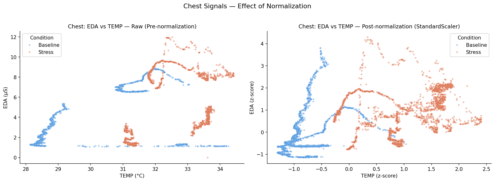
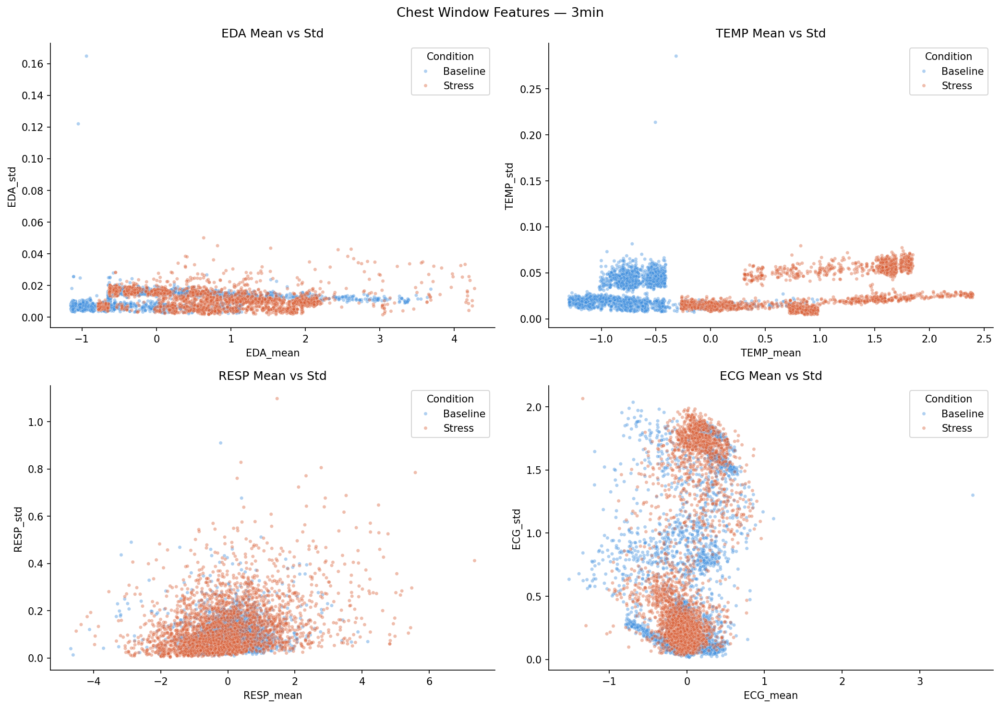
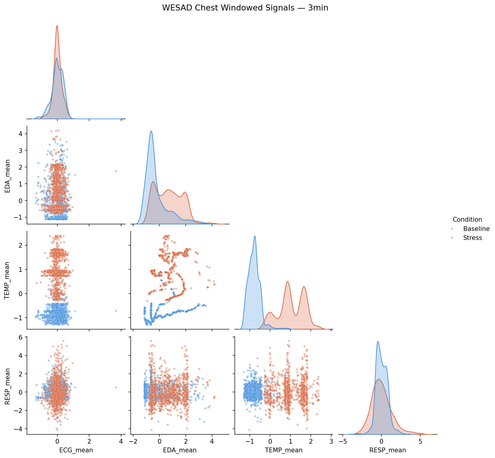
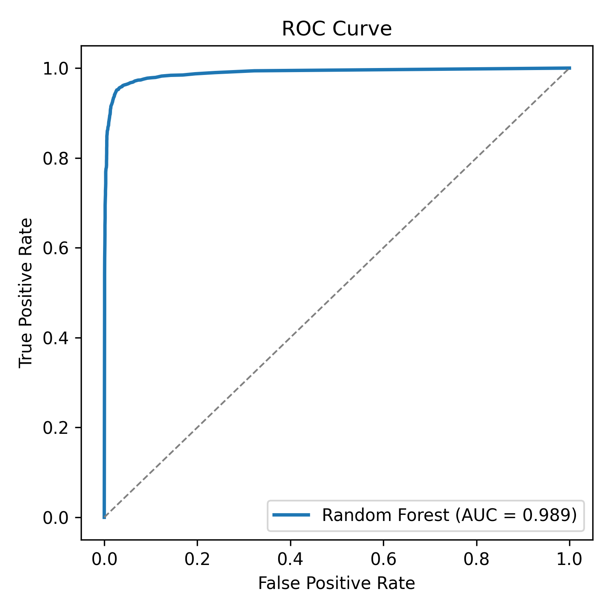

## Introduction: Why Stress Detection Matters

::: {layout-ncol="2"}

::: {#left-side style="font-size: 30px; line-height: 1.4; width: 48%;"}
- **Growing interest** in real-time stress detection and biomarkers from both military and corporate settings aiming to improve worker health and performance
- **Wearables** now capture BPM, HR, HRV, EDA, RESP, and TEMP continuously and non-invasively
- These signals are modeled two very different ways:
    - **Stochastic models** (e.g., ARIMA)
    - **Machine learning models** (e.g., Random Forest)
- **Our question:** can the simpler ARIMA model match Random Forest's accuracy in predicting stress state?
:::

::: {#right-side style="font-size: 30px; line-height: 1.4; width: 48%;"}
- **If ARIMA performs comparably**, it argues that stress can be predicted from physiological signals *without* the intensive training machine learning requires
- **We chose WESAD** because it provides multimodal physiological data across Baseline and Stress
- Literature review pointed us toward **HR, HRV, and EDA** as the strongest stress predictors, enhanced by **RESP and TEMP** as secondary signals
:::

:::

## Why ARIMA vs. Random Forest?

```{=html}
<svg width="100%" viewBox="0 0 680 260" role="img">
<title>ARIMA vs Random Forest comparison</title>
<defs>
<linearGradient id="arima-grad" x1="0" y1="0" x2="1" y2="1">
  <stop offset="0%" stop-color="#5DCAA5"/>
  <stop offset="100%" stop-color="#1D9E75"/>
</linearGradient>
<linearGradient id="rf-grad" x1="0" y1="0" x2="1" y2="1">
  <stop offset="0%" stop-color="#AFA9EC"/>
  <stop offset="100%" stop-color="#534AB7"/>
</linearGradient>
</defs>

<g>
  <rect x="30" y="30" width="290" height="200" rx="12" fill="url(#arima-grad)" opacity="0.95"/>
  <text x="175" y="60" text-anchor="middle" font-size="16" font-weight="bold" fill="#08402F">ARIMA</text>
  <text x="50" y="90" font-size="13" fill="#08402F">• Classical, linear time-series model</text>
  <text x="50" y="112" font-size="13" fill="#08402F">• Uses own past values + error terms</text>
  <text x="50" y="134" font-size="13" fill="#08402F">• Needs less data to train</text>
  <text x="50" y="156" font-size="13" fill="#08402F">• Highly interpretable</text>
  <text x="50" y="178" font-size="13" fill="#08402F">• Assumes stationarity + linearity</text>
  <text x="50" y="200" font-size="13" fill="#08402F">• Best on structured, low-dim data</text>
</g>

<g>
  <rect x="360" y="30" width="290" height="200" rx="12" fill="url(#rf-grad)" opacity="0.95"/>
  <text x="505" y="60" text-anchor="middle" font-size="16" font-weight="bold" fill="#26215C">Random Forest</text>
  <text x="380" y="90" font-size="13" fill="#26215C">• Ensemble machine learning model</text>
  <text x="380" y="112" font-size="13" fill="#26215C">• No linearity / distribution assumption</text>
  <text x="380" y="134" font-size="13" fill="#26215C">• More data-intensive to train</text>
  <text x="380" y="156" font-size="13" fill="#26215C">• Captures complex, nonlinear patterns</text>
  <text x="380" y="178" font-size="13" fill="#26215C">• Established WESAD benchmark</text>
  <text x="380" y="200" font-size="13" fill="#26215C">• Less interpretable than ARIMA</text>
</g>

<text x="340" y="245" text-anchor="middle" font-size="13" fill="#888780" font-style="italic">Central question: can simplicity (ARIMA) match performance (Random Forest)?</text>
</svg>
```

## Literature Review: ARIMA for Physiological Signals

::: {#left-side style="font-size: 28px; line-height: 1.45; width: 100%;"}
- **(Kontopoulou et al. 2023)** — ARIMA remains a broadly used, interpretable approach, particularly well-suited for structured, lower-dimensional datasets where its linearity assumptions hold reasonably well
- **(Ziyadidegan et al. 2025)** — Identified ARIMA as *underutilized* for physiological stress research, appearing in only 3 of 119 reviewed cardiovascular stress studies, despite its recognized capacity to capture temporal rhythms in cardiovascular and electrodermal signals
- **(Oyeleye et al. 2022)** — Found that ARIMA's accuracy can be heavily improved using a **rolling window** approach, letting the model learn from a window of time rather than treating each sample independently
- **Takeaway:** ECG and EDA both change measurably during stress and carry temporal structure — theoretically well-suited to ARIMA with a rolling window, which directly shaped our modeling pipeline
:::

## Literature Review: Selecting the Right Signals

::: {layout-ncol="2"}

::: {#left-side style="font-size: 28px; line-height: 1.4; width: 48%;"}
**(Luzzani and Demarchi 2024)**

- Examined statistical correlation between PPG, EDA, and skin temperature and stress/mental workload
- Analyzed 43 features using Kruskal-Wallis and Mann-Whitney U tests
- ~half the features statistically differentiated relaxed vs. altered emotional states; 15 could detect both mental workload and stress level
- **Gave us empirical support for choosing which features best discriminate stress**
:::

::: {#right-side style="font-size: 28px; line-height: 1.4; width: 48%;"}
**(Sosa and Atchison 2026)**

- Systematic review: EDA is a strong sympathetic nervous system (SNS) arousal indicator — but only *one part* of the picture
- Recommends multimodal systems combining EDA, HRV, PPG, skin temperature, and blood oxygen
- HRV reflects parasympathetic activity; EDA reflects sympathetic/sweat gland activity
- **Reinforced our multimodal approach: EDA + RESP + TEMP, alongside ECG**
:::

:::

## Literature Review: Random Forest & the WESAD Benchmark

::: {#left-side style="font-size: 28px; line-height: 1.45; width: 100%;"}
- **(Garg et al. 2021)** — Evaluated Random Forest against k-NN, Linear Discriminant Analysis, AdaBoost, and SVM on WESAD; Random Forest achieved consistently strong performance on both binary (stress vs. non-stress) and three-class (neutral, stress, amusement) tasks
- **(Schmidt and Reiss 2018)** — Original authors of the WESAD dataset; their own Random Forest experiments reached **88.33% baseline accuracy**, establishing RF as the benchmark comparator for this study
- **(Aigrain et al. 2015; Beltran 2024)** — Support mapping continuous physiological measurements to meaningful categorical states, which informed how we converted ARIMA's continuous forecasts into participant-specific stress/non-stress labels
- **Takeaway:** together, these findings position Random Forest as a well-validated, high-performing method for stress classification on WESAD — and set the bar ARIMA needed to reach
:::

## Literature Review Summary

| Paper | Focus | How It Shaped Our Study |
|---|---|---|
| Kontopoulou et al. 2023 | ARIMA strengths/limits | Confirmed ARIMA fits structured, low-dim signals |
| Ziyadidegan et al. 2025 | ARIMA underuse in stress research | Motivated testing ARIMA on ECG/EDA |
| Oyeleye et al. 2022 | Rolling windows for ARIMA | Basis for our 1-min/3-min rolling window pipeline |
| Luzzani & Demarchi 2024 | Feature-level stress discrimination | Guided feature selection across PPG/EDA/TEMP |
| Sosa & Atchison 2026 | Multimodal SNS/PNS review | Justified combining EDA, RESP, TEMP, ECG |
| Garg et al. 2021 | RF vs. other classifiers on WESAD | Confirmed RF as strongest ML baseline |
| Schmidt & Reiss 2018 | WESAD dataset + RF baseline | Set the 88.33% benchmark we compare against |
| Aigrain et al. 2015; Beltran 2024 | Categorizing continuous variables | Informed our ARIMA-to-label classification rule |

## Overview

- **Project:** Comparing ARIMA and Random Forest for stress state 
detection using WESAD wearable sensor data
- **Goal:** Determine if ARIMA can match Random Forest in classifying 
stress states without complex training
- **Approach:** Extract ECG and EDA signals, engineer rolling window 
features, evaluate with final Accuracy, Precision, Recall, F1-Score, and ROC-AUC curves


<!-- ==================================================== -->
<!-- INDUPRIYA: Slides Starts Here                        -->
<!-- ==================================================== -->

## Dataset & Signal Introduction


**Dataset Overview**

* **WESAD Dataset:** Multimodal physiological recordings from 15 participants under Baseline, Stress conditions
* **Focused on 3 subjects (S2, S3, S4):** Chosen for signal quality and coverage of both conditions
* **Two sensor locations:**
    * Chest (700Hz): ECG, EDA, TEMP, RESP
    * Wrist (4Hz): EDA, TEMP
* **Scale:** ~4.5 million chest observations, ~25,764 wrist observations across the three subjects


**Why these signals matter:**

* **ECG:** Captures cardiac stress response
* **EDA:** Reflects sympathetic nervous system arousal
* **TEMP:** Captures autonomic stress response
* **RESP:** Captures breathing rate changes
* *Each offers a different physiological window into the stress response*


## Data Cleaning & Normalization

::: {layout-ncol="2"}

::: {#left-side style="font-size: 10px; line-height: 0.8; width: 10%;"}
- **Raw Processing:** Loaded raw WESAD pickle files and extracted synchronized chest and wrist signals
- **Sanity Checks:** Removed implausible readings (TEMP outside 20–45°C, negative EDA values)
- **Binary Mapping:** Consolidated labels into binary targets: `0 = Non-Stress (Baseline)`, `1 = Stress`
- **Normalization:** Subject-specific `StandardScaler` applied — fit only on training data, transformed on test data
- **Why this matters:**
    - Removes individual baseline physiological differences between subjects
    - Prevents critical data leakage before modeling
:::
::: {#right-side style="font-size: 15px; line-height: 1.0; width: 28%;"}

**Normalization on Chest EDA and TEMP** {fig-align="center" width="90%"}
{fig-align="center" width="90%"}

```{=html}
<svg width="80%" viewBox="0 0 700 280" role="img" style="background: transparent;">
<defs>
  <filter id="card-shadow" x="-10%" y="-10%" width="120%" height="120%">
    <feDropShadow dx="2" dy="4" stdDeviation="4" flood-color="#000" flood-opacity="0.15"/>
  </filter>
  <linearGradient id="intake-grad" x1="0" y1="0" x2="1" y2="1">
    <stop offset="0%" stop-color="#4E54C8"/>
    <stop offset="100%" stop-color="#8F94FB"/>
  </linearGradient>
  <linearGradient id="clean-grad" x1="0" y1="0" x2="1" y2="1">
    <stop offset="0%" stop-color="#11998e"/>
    <stop offset="100%" stop-color="#38ef7d"/>
  </linearGradient>
  <linearGradient id="scale-grad" x1="0" y1="0" x2="1" y2="1">
    <stop offset="0%" stop-color="#f857a6"/>
    <stop offset="100%" stop-color="#ff5858"/>
  </linearGradient>
  <linearGradient id="output-grad" x1="0" y1="0" x2="1" y2="1">
    <stop offset="0%" stop-color="#FF416C"/>
    <stop offset="100%" stop-color="#FF4B2B"/>
  </linearGradient>
</defs>

<g opacity="0.05" stroke="#FFF" stroke-width="1">
  <line x1="20" y1="0" x2="20" y2="250" />
  <line x1="185" y1="0" x2="185" y2="250" />
  <line x1="350" y1="0" x2="350" y2="250" />
  <line x1="515" y1="0" x2="515" y2="250" />
  <line x1="680" y1="0" x2="680" y2="250" />
  <line x1="0" y1="125" x2="700" y2="125" />
</g>

<path d="M155,125 L190,125" stroke="#8F94FB" stroke-width="4" stroke-linecap="round" opacity="0.6"/>
<path d="M320,125 L355,125" stroke="#38ef7d" stroke-width="4" stroke-linecap="round" opacity="0.6"/>
<path d="M485,125 L520,125" stroke="#ff5858" stroke-width="4" stroke-linecap="round" opacity="0.6"/>

<g filter="url(#card-shadow)">
  <rect x="20" y="5" width="135" height="235" rx="12" fill="url(#intake-grad)" opacity="0.95"/>
  <rect x="20" y="5" width="135" height="40" rx="12" fill="#000" opacity="0.2"/>
  <text x="87" y="30" text-anchor="middle" font-size="12" font-weight="bold" fill="#FFF" letter-spacing="1">01 / INGEST</text>
  <text x="35" y="80" font-size="11" font-weight="bold" fill="#FFF">WESAD Core</text>
  <text x="35" y="110" font-size="13" fill="#E2E0D8">• Chest: 700Hz</text>
  <text x="35" y="135" font-size="13" fill="#E2E0D8">• Wrist: 4Hz</text>
</g>

<g filter="url(#card-shadow)">
  <rect x="185" y="5" width="135" height="235" rx="12" fill="url(#clean-grad)" opacity="0.95"/>
  <rect x="185" y="5" width="135" height="40" rx="12" fill="#000" opacity="0.2"/>
  <text x="252" y="30" text-anchor="middle" font-size="12" font-weight="bold" fill="#FFF" letter-spacing="1">02 / SANITY</text>
  <text x="200" y="80" font-size="13" font-weight="bold" fill="#FFF">Artifact Gate</text>
  <text x="200" y="110" font-size="13" fill="#FFF">• TEMP: 20-45°C</text>
  <text x="200" y="135" font-size="13" fill="#FFF">• EDA: &ge; 0 Bound</text>
  <rect x="200" y="165" width="105" height="22" rx="4" fill="#000" opacity="0.15"/>
  <text x="252" y="179" text-anchor="middle" font-size="10" font-weight="bold" fill="#FFF">ffill() + bfill()</text>
</g>

<g filter="url(#card-shadow)">
  <rect x="350" y="5" width="135" height="235" rx="12" fill="url(#scale-grad)" opacity="0.95"/>
  <rect x="350" y="5" width="135" height="40" rx="12" fill="#000" opacity="0.2"/>
  <text x="417" y="30" text-anchor="middle" font-size="12" font-weight="bold" fill="#FFF" letter-spacing="1">03 / SCALING</text>
  <text x="365" y="80" font-size="11" font-weight="bold" fill="#FFF">Subject Split</text>
  <text x="365" y="110" font-size="13" fill="#FFF">• Fit Train Only</text>
  <text x="365" y="135" font-size="13" fill="#FFF">• No Leakage</text>
  <text x="365" y="180" font-size="13" font-weight="bold" fill="#FFF">StandardScaler</text>
</g>

<g filter="url(#card-shadow)">
  <rect x="515" y="5" width="145" height="235" rx="12" fill="url(#output-grad)" opacity="0.95"/>
  <rect x="515" y="5" width="145" height="40" rx="12" fill="#000" opacity="0.2"/>
  <text x="587" y="30" text-anchor="middle" font-size="12" font-weight="bold" fill="#FFF" letter-spacing="1">04 / OUTPUT</text>
  <text x="530" y="80" font-size="11" font-weight="bold" fill="#FFF">Target Reshape</text>
  <text x="530" y="110" font-size="10" fill="#FFF">Base (1,3) &rarr; 0</text>
  <text x="530" y="135" font-size="10" fill="#FFF">Stress (2) &rarr; 1</text>
  <rect x="530" y="168" width="55" height="20" rx="4" fill="#FFF" fill-opacity="0.2"/>
  <text x="557" y="182" text-anchor="middle" font-size="10" font-weight="bold" fill="#FFF">700Hz</text>
  <rect x="593" y="168" width="55" height="20" rx="4" fill="#FFF" fill-opacity="0.2"/>
  <text x="620" y="182" text-anchor="middle" font-size="10" font-weight="bold" fill="#FFF">4Hz</text>
</g>
</svg>
```
:::
::: 


## Train/Test Split & Rolling Window Features

<div style="display: flex; gap: 30px; align-items: flex-start; justify-content: space-between; width: 100%;">

<!-- Left Column: Large Bullet Points -->
<div style="width: 46%; font-size: 20px; line-height: 1.4; color: #FFF;">

- **Block-Stratified Split:** 80/20 chronological partitioning preserves time order, prevents data leakage, and ensures both classes populate the test set.
- **Rolling Features:** Engineered rolling mean, standard deviation, minimum, and maximum calculations per signal channel.
- **Dual Window Strategy:** 
    - **1-minute window:** engineered to capture immediate, acute stress onset spikes.
    - **3-minute window:** engineered to filter out momentary noise and capture sustained physiological arousal trends.
- **Literature Grounding:** Oyeleye et al. 2022 established that rolling windows significantly improve physiological forecasting.

</div>

<!-- Right Column: Stable White Plot Frame Card -->
<div style="width: 32%; background-color: #FFFFFF; padding: 10px; border-radius: 12px; box-shadow: 0 10px 25px rgba(0,0,0,0.5);">

{fig-align="center" width="85%"}

{fig-align="center" width="85%"}

</div>

</div>

## Random Forest Modeling Approach

::: {layout-ncol="2"}

::: {#left-side style="font-size: 22px; line-height: 1.0; width: 40%;"}
- **Model Distribution:** Separate Random Forest model trained per subject × signal × window size 
- **Model Array:** Results in 24 distinct models total (3 subjects × 4 signals × 2 windows)
- **Independent Evaluation:** Each individual signal channel (ECG, EDA, TEMP, RESP) was tested completely on its own
- **Biomarker Identification:** Pinpoints exactly which individual physiological biomarker is most predictive of stress
:::

::: {#right-side style="font-size: 22px; line-height: 1.0; width: 40%;"}
- **Hyperparameter Tuning:** Implemented a standard `RandomForestClassifier` initialized with 100 trees
- **Subject-Specific Training:** Individual modeling respects localized baseline physiological differences
- **Fair Model Comparison:** Evaluated using identical performance metrics as the baseline ARIMA model 
- **Target Tracking:** Tracked final Accuracy, Precision, Recall, F1-Score, and ROC-AUC curves
:::

```{=html}
<svg width="100%" viewBox="0 0 680 300" role="img" style="background: transparent;">
<title>Random Forest Multi-Model Distribution Architecture</title>
<defs>
<marker id="arrow" viewBox="0 0 10 10" refX="8" refY="5" markerWidth="6" markerHeight="6" orient="auto-start-reverse">
<path d="M2 1L8 5L2 9" fill="none" stroke="#FFF" stroke-width="1.5" stroke-linecap="round" stroke-linejoin="round"/>
</marker>
</defs>

<!-- SECTION 1: INTEGRATED CHANNELS -->
<g>
  <rect x="20" y="110" width="110" height="70" rx="8" fill="none" stroke="#FFF" stroke-width="1.5"/>
  <text x="75" y="132" text-anchor="middle" dominant-baseline="central" font-size="12" fill="#FFF" font-weight="bold">Biomarkers</text>
  <text x="75" y="152" text-anchor="middle" dominant-baseline="central" font-size="10" fill="#E2E0D8">ECG • EDA</text>
  <text x="75" y="166" text-anchor="middle" dominant-baseline="central" font-size="10" fill="#E2E0D8">TEMP • RESP</text>
</g>

<!-- Branching out to Parallel Models -->
<line x1="130" y1="130" x2="200" y2="60" stroke="#FFF" stroke-width="1.5" marker-end="url(#arrow)"/>
<line x1="130" y1="145" x2="200" y2="145" stroke="#FFF" stroke-width="1.5" marker-end="url(#arrow)"/>
<line x1="130" y1="160" x2="200" y2="230" stroke="#FFF" stroke-width="1.5" marker-end="url(#arrow)"/>

<!-- SECTION 2: INDEPENDENT SUBJECT SEGMENTS -->
<!-- Model Path A -->
<g>
  <rect x="200" y="25" width="130" height="55" rx="6" fill="none" stroke="#FFF" stroke-width="1.5"/>
  <text x="265" y="44" text-anchor="middle" dominant-baseline="central" font-size="11" fill="#FFF" font-weight="bold">Subject S2 Models</text>
  <text x="265" y="60" text-anchor="middle" dominant-baseline="central" font-size="10" fill="#E2E0D8">8 Combinations</text>
</g>

<!-- Model Path B -->
<g>
  <rect x="200" y="115" width="130" height="55" rx="6" fill="none" stroke="#FFF" stroke-width="1.5"/>
  <text x="265" y="134" text-anchor="middle" dominant-baseline="central" font-size="11" fill="#FFF" font-weight="bold">Subject S3 Models</text>
  <text x="265" y="150" text-anchor="middle" dominant-baseline="central" font-size="10" fill="#E2E0D8">8 Combinations</text>
</g>

<!-- Model Path C -->
<g>
  <rect x="200" y="205" width="130" height="55" rx="6" fill="none" stroke="#FFF" stroke-width="1.5"/>
  <text x="265" y="224" text-anchor="middle" dominant-baseline="central" font-size="11" fill="#FFF" font-weight="bold">Subject S4 Models</text>
  <text x="265" y="240" text-anchor="middle" dominant-baseline="central" font-size="10" fill="#E2E0D8">8 Combinations</text>
</g>

<!-- Convergence to Model Details -->
<line x1="330" y1="55" x2="385" y2="125" stroke="#FFF" stroke-width="1.2"/>
<line x1="330" y1="145" x2="385" y2="145" stroke="#FFF" stroke-width="1.2"/>
<line x1="330" y1="235" x2="385" y2="165" stroke="#FFF" stroke-width="1.2"/>

<!-- SECTION 3: CLASSIFIER ARCHITECTURE -->
<g transform="translate(385, 110)">
  <rect x="0" y="0" width="145" height="70" rx="8" fill="none" stroke="#AFA9EC" stroke-width="1.5"/>
  <text x="72" y="22" text-anchor="middle" dominant-baseline="central" font-size="11" fill="#AFA9EC" font-weight="bold">RandomForestClassifier</text>
  <text x="72" y="42" text-anchor="middle" dominant-baseline="central" font-size="10" fill="#FFF">Trees: B = 100</text>
  <text x="72" y="56" text-anchor="middle" dominant-baseline="central" font-size="10" fill="#E2E0D8">Total Trained: 24</text>
</g>

<line x1="530" y1="145" x2="560" y2="145" stroke="#FFF" stroke-width="1.5" marker-end="url(#arrow)"/>

<!-- SECTION 4: UNIFIED METRICS EVALUATION -->
<g transform="translate(560, 95)">
  <rect x="0" y="0" width="110" height="100" rx="8" fill="none" stroke="#5DCAA5" stroke-width="1.5"/>
  <text x="55" y="16" text-anchor="middle" dominant-baseline="central" font-size="11" fill="#5DCAA5" font-weight="bold">ARIMA Match</text>
  <text x="12" y="38" font-size="10" fill="#FFF">• Accuracy</text>
  <text x="12" y="52" font-size="10" fill="#FFF">• Precision / Recall</text>
  <text x="12" y="66" font-size="10" fill="#FFF">• F1-Score</text>
  <text x="12" y="80" font-size="10" fill="#FFF">• ROC-AUC</text>
</g>

<!-- Column Labels for Aesthetic Alignment -->
<text x="75" y="15" text-anchor="middle" font-size="10" font-weight="bold" fill="#AFA9EC">INPUT SEPARATION</text>
<text x="265" y="15" text-anchor="middle" font-size="10" font-weight="bold" fill="#AFA9EC">SUBJECT VARIANCE</text>
<text x="457" y="15" text-anchor="middle" font-size="10" font-weight="bold" fill="#AFA9EC">ENSEMBLE MATRIX</text>
<text x="615" y="15" text-anchor="middle" font-size="10" font-weight="bold" fill="#AFA9EC">EVALUATION</text>

</svg>
```


:::

## RF Results

::: {layout-ncol="2"}

::: {#left-side style="font-size: 25px; line-height: 1.2; width: 38%;"}
- **Signal Accuracy Metrics:** Achieved the following 3-minute window average accuracies across subjects S2–S4:
    - **ECG:** 0.90
    - **TEMP:** 0.86
    - **RESP:** 0.76
    - **EDA:** 0.61
- **Model Dominance:** Random Forest consistently outperformed ARIMA across nearly all signal and subject combinations

- **Temporal Advantage:** Deploying 3-minute rolling windows generally improved classifier performance over shorter 1-minute steps
- **Notable EDA Anomaly:** EDA performance for subject S2 dropped significantly to 0.04 accuracy compared to S3/S4 (0.78–1.00)
- **Data Limitation:** The S2 drop is flagged as a localized sensor data issue rather than an underlying modeling failure
:::
::: {#right-side style="font-size: 32px; line-height: 1.4; width: 38%;"}

:::

:::
## RF Results

::: {layout-ncol="2"}

::: {#left-side style="font-size: 25px; line-height: 1.2; width: 38%;"}

**RF Accuracy by Signal (3-min window, avg across S2–S4)**

| Signal | Accuracy |
|--------|----------|
| ECG    | 0.90     |
| TEMP   | 0.86     |
| RESP   | 0.76     |
| EDA    | 0.61     |

**RF Performance — Selected Subjects (3-min window)**

| Signal | Subject | RF Accuracy | RF F1  |
|--------|---------|-------------|--------|
| ECG    | S3      | 0.9587      | 0.9545 |
| EDA    | S4      | 1.0000      | 1.0000 |
| TEMP   | S3      | 0.9509      | 0.9449 |
| ECG    | S2      | 0.8429      | 0.8265 |
:::

:::


## What is ARIMA
-arima content goes here
-arima content goes here
-arima content goes here